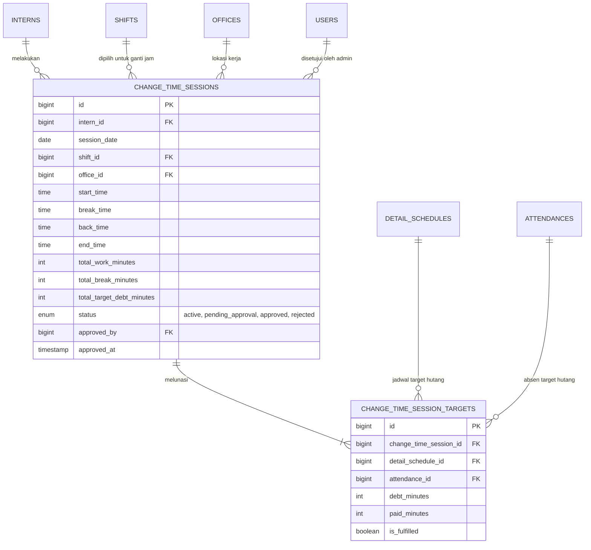
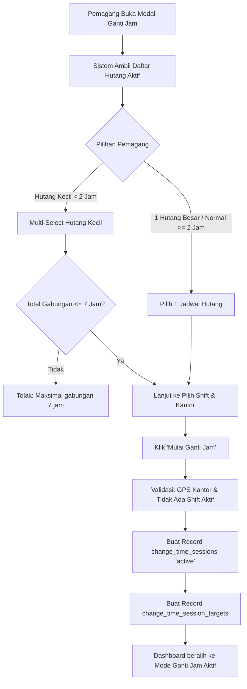
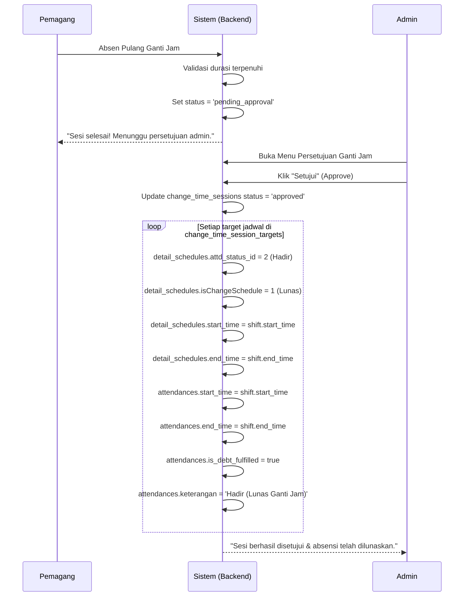

# 🔄 Spesifikasi & Rencana Implementasi Fitur Ganti Jam (Change Time System Redesign)

> **Status**: ✅ **Disetujui (Finalized Architecture)**  
> **Tanggal Rilis Rencana**: 29 September 2026  
> **Target Versi**: v2.0 (Clean Architecture)

---

## 1. Ringkasan Eksekutif & Keputusan Desain

Mendesain ulang total sistem **Ganti Jam (Change Time)** dengan arsitektur baru yang bersih, transparan, dan tidak menabrak jadwal absensi utama:

1. **Tabel Baru `change_time_sessions` & `change_time_session_targets`**: Menggantikan tabel lama `adjustable_attds`.
2. **Aturan 1 Sesi 1 Hutang (atau Gabungan Hutang Kecil)**:
   - Default: **1 sesi = 1 jadwal hutang**.
   - Pengecualian: Hutang-hutang kecil di bawah 2 jam (misal: telat 15 menit, izin 30 menit, pulang awal 45 menit) **dapat digabungkan (multi-select)** dalam 1 sesi, dengan **batas total maksimal hingga 7 jam** (1 shift penuh).
3. **Sesi Wajib Tuntas (Tidak Bisa Dibatalkan)**:
   - Begitu sesi ganti jam dimulai, pemagang harus menuntaskan durasi kerja sesuai target hutang yang dipilih.
   - Tombol "Pulang Ganti Jam" terkunci / ditolak jika durasi belum lunas: *"Hutang belum lunas, selesaikan dahulu (Kurang X jam Y menit)"*.
4. **Alur Persetujuan Admin (Approval Workflow)**:
   - Setelah pemagang absen pulang, status sesi menjadi **`pending_approval`** (Menunggu Persetujuan Admin).
   - Admin menyetujui sesi melalui menu Monitoring / Persetujuan Ganti Jam.
   - Saat Admin menyetujui (**Approve**), sistem otomatis melunaskan absensi jadwal terkait:
     - `attendances` tanggal hutang: `start_time` & `end_time` diset ke jam shift resmi, `keterangan` = *"Hadir (Lunas Ganti Jam)"*, `is_debt_fulfilled` = `true`.
     - `detail_schedules` tanggal hutang: `attd_status_id` = `2` (Hadir), `isChangeSchedule` = `1`.
5. **Tampilan Jadwal Dinamis (Hide Regular Schedule)**:
   - Saat pemagang sedang aktif dalam sesi ganti jam, card jadwal reguler **di-hide** dan digantikan oleh card khusus **"Sesi Ganti Jam Aktif"** lengkap dengan progress bar dan target jam.

---

## 2. Struktur Skema Database Baru

### 2.1 Tabel `change_time_sessions`
Menyimpan sesi pelaksanaan absensi ganti jam pemagang.

```sql
CREATE TABLE change_time_sessions (
  id BIGINT UNSIGNED AUTO_INCREMENT PRIMARY KEY,
  
  -- Identitas & Waktu Sesi
  intern_id BIGINT UNSIGNED NOT NULL,
  session_date DATE NOT NULL,
  
  -- Shift & Kantor yang digunakan untuk ganti jam
  shift_id BIGINT UNSIGNED NOT NULL,
  office_id BIGINT UNSIGNED NOT NULL,
  
  -- Rekaman Waktu Absen Sesi Ganti Jam
  start_time TIME NOT NULL,
  break_time TIME NULL,
  back_time TIME NULL,
  end_time TIME NULL,
  
  -- Total Durasi
  total_work_minutes INT NOT NULL DEFAULT 0,
  total_break_minutes INT NOT NULL DEFAULT 0,
  total_target_debt_minutes INT NOT NULL DEFAULT 0, -- Total target hutang yang harus dilunasi
  
  -- Status Sesi & Approval Admin
  status ENUM('active', 'pending_approval', 'approved', 'rejected') NOT NULL DEFAULT 'active',
  approved_by BIGINT UNSIGNED NULL,
  approved_at TIMESTAMP NULL,
  rejection_note TEXT NULL,
  
  -- Pesan Verifikasi & Log
  start_time_message TEXT NULL,
  break_time_message TEXT NULL,
  back_time_message TEXT NULL,
  end_time_message TEXT NULL,
  
  -- Lokasi GPS
  latitude_start DOUBLE NULL,
  longitude_start DOUBLE NULL,
  latitude_end DOUBLE NULL,
  longitude_end DOUBLE NULL,
  
  -- Timestamps
  created_at TIMESTAMP NULL DEFAULT CURRENT_TIMESTAMP,
  updated_at TIMESTAMP NULL DEFAULT CURRENT_TIMESTAMP ON UPDATE CURRENT_TIMESTAMP,
  
  -- Foreign Keys & Indexes
  INDEX idx_intern_session (intern_id, session_date),
  INDEX idx_session_status (status),
  CONSTRAINT fk_cts_intern FOREIGN KEY (intern_id) REFERENCES interns(id) ON DELETE CASCADE,
  CONSTRAINT fk_cts_shift FOREIGN KEY (shift_id) REFERENCES shifts(id),
  CONSTRAINT fk_cts_office FOREIGN KEY (office_id) REFERENCES offices(id),
  CONSTRAINT fk_cts_approver FOREIGN KEY (approved_by) REFERENCES users(id) ON DELETE SET NULL
);
```

### 2.2 Tabel `change_time_session_targets`
Tabel pivot / relasi yang mencatat detail hutang mana saja yang dilunasi oleh sesi tersebut (Mendukung 1 hutang penuh ATAU gabungan hutang kecil < 2 jam).

```sql
CREATE TABLE change_time_session_targets (
  id BIGINT UNSIGNED AUTO_INCREMENT PRIMARY KEY,
  change_time_session_id BIGINT UNSIGNED NOT NULL,
  detail_schedule_id BIGINT UNSIGNED NOT NULL,
  attendance_id BIGINT UNSIGNED NULL,
  
  -- Rincian Hutang
  debt_minutes INT NOT NULL,                  -- Jumlah hutang pada jadwal ini
  paid_minutes INT NOT NULL DEFAULT 0,        -- Jumlah menit yang dialokasikan
  is_fulfilled BOOLEAN NOT NULL DEFAULT FALSE,-- Apakah jadwal ini dinyatakan lunas
  
  created_at TIMESTAMP NULL DEFAULT CURRENT_TIMESTAMP,
  updated_at TIMESTAMP NULL DEFAULT CURRENT_TIMESTAMP ON UPDATE CURRENT_TIMESTAMP,
  
  -- Constraints & Indexes
  CONSTRAINT fk_ctst_session FOREIGN KEY (change_time_session_id) REFERENCES change_time_sessions(id) ON DELETE CASCADE,
  CONSTRAINT fk_ctst_schedule FOREIGN KEY (detail_schedule_id) REFERENCES detail_schedules(id) ON DELETE CASCADE,
  CONSTRAINT fk_ctst_attendance FOREIGN KEY (attendance_id) REFERENCES attendances(id) ON DELETE SET NULL,
  INDEX idx_session_schedule (change_time_session_id, detail_schedule_id)
);
```

### 2.3 Perubahan Kolom pada Tabel `attendances`

```sql
ALTER TABLE attendances
  ADD COLUMN is_debt_fulfilled BOOLEAN NOT NULL DEFAULT FALSE AFTER auto_end_notified,
  ADD COLUMN debt_fulfilled_session_id BIGINT UNSIGNED NULL AFTER is_debt_fulfilled,
  ADD COLUMN debt_fulfilled_at TIMESTAMP NULL AFTER debt_fulfilled_session_id;

ALTER TABLE attendances
  ADD CONSTRAINT fk_att_fulfilled_session 
  FOREIGN KEY (debt_fulfilled_session_id) REFERENCES change_time_sessions(id) ON DELETE SET NULL;
```

---

## 3. Entity Relationship Diagram (ERD)



---

## 4. Alur Kerja Sistem (Workflow)

### 4.1 Pemilihan Hutang & Validasi Mulai Ganti Jam


### 4.2 Siklus Kerja Sesi Ganti Jam
1. **Masuk (`start_time`)**:
   - Merekam jam mulai, lokasi GPS, dan foto/pesan.
   - Status: `active`.
   - Card reguler disembunyikan, card ganti jam aktif muncul.
2. **Istirahat (`break_time`) & Kembali (`back_time`)**:
   - Jika shift memiliki alokasi istirahat, pemagang dapat menekan tombol Istirahat dan Kembali.
   - Menit istirahat tidak dihitung ke dalam `total_work_minutes`.
3. **Pulang (`end_time`)**:
   - Sistem memvalidasi: `total_work_minutes >= total_target_debt_minutes`.
   - Jika belum cukup: Muncul dialog error *"Hutang belum lunas, selesaikan dahulu. Anda baru bekerja X jam Y menit dari target Z jam."*
   - Jika sudah cukup: Sesi ditutup, status berubah menjadi **`pending_approval`**.

### 4.3 Approval Admin & Pelunasan Otomatis


---

## 5. Komponen & File yang Dibuat / Dirombak

### 5.1 Layer Database
- `database/migrations/2026_09_29_100000_create_change_time_sessions_table.php`
- `database/migrations/2026_09_29_100001_create_change_time_session_targets_table.php`
- `database/migrations/2026_09_29_100002_add_debt_fulfilled_columns_to_attendances_table.php`

### 5.2 Layer Model
- `app/Models/ChangeTimeSession.php` (Model sesi ganti jam dengan relasi & scope).
- `app/Models/ChangeTimeSessionTarget.php` (Model pivot target jadwal hutang).
- `app/Models/Attendance.php` (Update relasi `changeTimeSession`).

### 5.3 Layer Service (Business Logic)
- `app/Services/DebtCalculationService.php`:
  - Sentralisasi perhitungan hutang dari `attendances`, `detail_schedules`, keterlambatan, pulang awal, izin keluar wajib ganti, dan alpha.
  - Mengelompokkan hutang (kategori `>= 2 jam` vs `< 2 jam`).
- `app/Services/ChangeTimeService.php`:
  - Method `startSession(int $internId, array $targetScheduleIds, int $shiftId, int $officeId, ?float $lat, ?float $lng, ?string $msg)`
  - Method `startBreak(int $sessionId, ?string $msg)`
  - Method `endBreak(int $sessionId, ?string $msg)`
  - Method `endSession(int $sessionId, ?float $lat, ?float $lng, ?string $msg)`
  - Method `approveSession(int $sessionId, int $adminUserId)`
  - Method `rejectSession(int $sessionId, int $adminUserId, string $reason)`

### 5.4 Layer Livewire & View
- `app/Livewire/AttdStatusButton.php`: Terhubung ke `ChangeTimeService` untuk handling state ganti jam.
- `app/Livewire/ChangeTimeInfoContainer.php`: Menampilkan card sesi ganti jam aktif beserta indikator progres hutang.
- `resources/views/livewire/change-time-info-container.blade.php`: Tampilan visual card ganti jam.
- `resources/views/users/index.blade.php`: Conditional render: jika ada sesi ganti jam aktif, card reguler disembunyikan.
- `resources/views/admin/ganti-jam/index.blade.php` / menu Approval Admin: Halaman bagi admin untuk menyetujui / menolak sesi ganti jam pemagang.

---

## 6. Rencana Eksekusi Bertahap (Roadmap)

| Fase | Durasi | Task Utama |
|---|---|---|
| **Fase 1: Database & Model** | Selesai Cepat | Buat 3 migration file baru, run migration, buat model `ChangeTimeSession` & `ChangeTimeSessionTarget`. |
| **Fase 2: Service Layer** | Fokus Logic | Buat `DebtCalculationService` & `ChangeTimeService` lengkap dengan unit test logic hutang dan approval. |
| **Fase 3: Livewire & Dashboard User** | Visual & State | Integrasikan tombol aksi Livewire, modal multi-select hutang kecil (< 2 jam) & hutang normal, dan card info ganti jam. |
| **Fase 4: Panel Approval Admin** | Manajemen | Buat view dan controller bagi Admin untuk menyetujui/menolak pengajuan ganti jam pemagang. |
| **Fase 5: Migrasi Data Lama & Testing** | Finalisasi | Migrasi data dari `adjustable_attds` ke skema baru, verifikasi end-to-end. |

---

## 7. Verifikasi & Checklist Keamanan

- [x] Sesi tidak bisa di-checkout sebelum menit kerja memenuhi target hutang.
- [x] Tidak bisa memulai ganti jam jika pemagang sedang aktif dalam jam kerja shift reguler hari ini.
- [x] Multi-select hutang dibatasi hanya untuk hutang < 2 jam dan total gabungan tidak melebihi 7 jam.
- [x] Absensi target tidak dimodifikasi sebelum Admin menekan tombol Approve.
- [x] Saat sesi aktif, refresh halaman tetap menampilkan card ganti jam dengan benar (anti visual bug).
- [x] Tabel lama `adjustable_attds` tetap aman dan tidak langsung didrop untuk menjaga integritas data historis.
