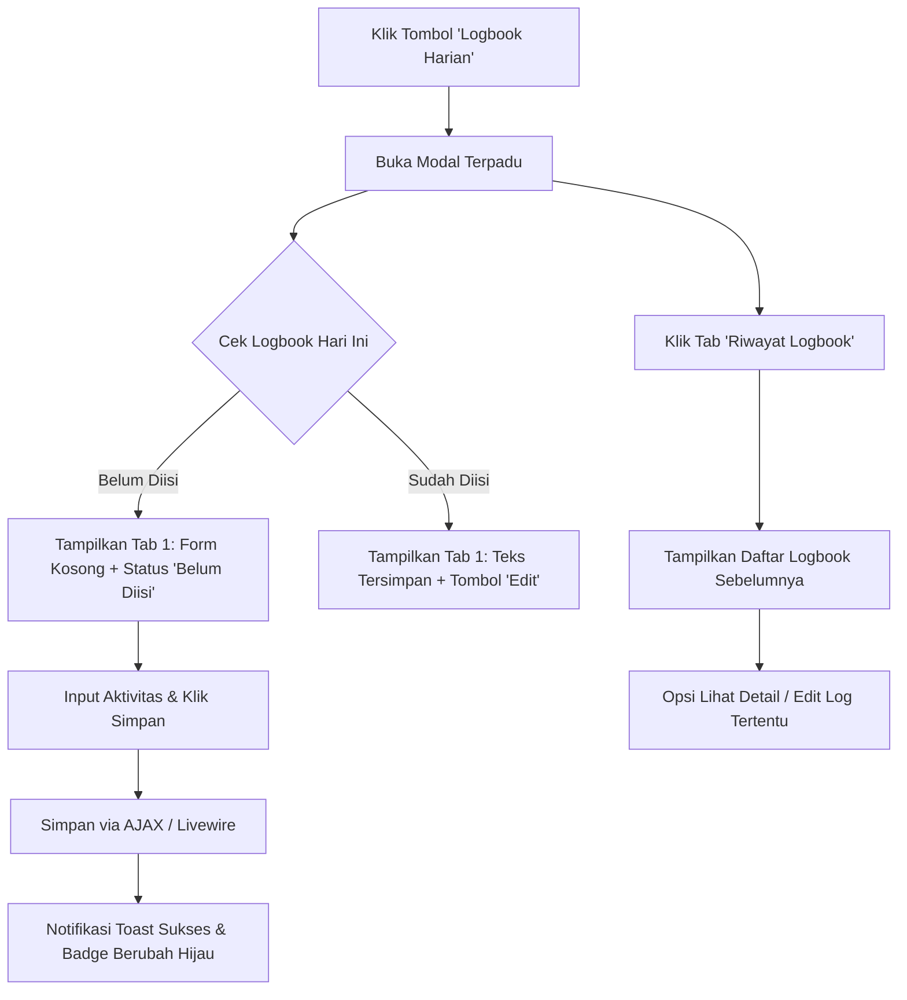

# Desain Konsep: Modal Terpadu Logbook Harian (Pendekatan B)

Dokumen ini menyajikan gambaran desain, arsitektur antarmuka (UI/UX), dan alur interaksi untuk **Pendekatan B: Modal Terpadu 2 Tab** pada fitur **Logbook Harian** (sebelumnya *Log Activity* & *History Log Activity*) di halaman dashboard pemagang **Absen Djuragan**.

---

## 1. Konsep Utama & Tujuan

### Masalah Saat Ini:
- Panel aksi pemagang memiliki **2 tombol terpisah**:
  1. `Log Activity` (membuka modal input kegiatan hari ini).
  2. `History Log Activity` (pindah ke halaman baru yang berbeda).
- Pemagang sering lupa mengisi logbook sebelum menekan tombol **Pulang**.
- Jika ingin mengecek apakah hari ini sudah mengisi atau melihat catatan kemarin, pemagang harus meninggalkan halaman dashboard utama, yang menginterupsi alur presensi.

### Solusi Pendekatan B:
- Menggabungkan kedua fitur ke dalam **1 tombol tunggal di Dashboard** dengan nama **"Logbook Harian"**.
- Saat tombol ditekan, muncul **Modal Terpadu (2 Tab)**:
  - **Tab 1: Laporan Hari Ini**: Formulir pengisian aktivitas hari ini (lengkap dengan status apakah sudah disubmit atau belum).
  - **Tab 2: Riwayat Logbook**: Tabel riwayat logbook hari-hari sebelumnya beserta status approval dari mentor/admin.
- Pemagang **tidak perlu berpindah halaman** sehingga timer presensi dan konteks dashboard tetap terjaga utuh.

---

## 2. Tampilan Tombol pada Dashboard Pemagang

Tombol di sidebar aksi pemagang disederhanakan menjadi satu komponen cerdas dengan indikator status:

```
+-------------------------------------------------------------+
|                     SIDEBAR AKSI PEMAGANG                   |
+-------------------------------------------------------------+
|  [ Shift Pagi (08:00 - 16:00) ]                             |
|  [ 🏠 Pulang ]                                              |
|  [ ⏰ Ganti Jam ]                                            |
|  [ 📝 Logbook Harian          (🔴 Belum Diisi) ]  <-- BARU  |
|  [ ℹ️ Info & Libur ]                                        |
|  [ 📢 Pengumuman ]                                          |
|  [ ✋ Angkat Tangan ]                                       |
+-------------------------------------------------------------+
```

> **Smart Indicator:**
> - Jika hari ini **belum mengisi**: Menampilkan penanda titik merah / label kecil *"Belum Diisi"* sebagai pengingat sebelum klik tombol pulang.
> - Jika hari ini **sudah mengisi**: Berubah menjadi ikon centang hijau / label *"Sudah Diisi"*.

---

## 3. Wireframe & Visual Mockup Modal

### A. Tampilan Tab 1: Input / Status Logbook Hari Ini

```
+-----------------------------------------------------------------------------------+
|  📝 Logbook Harian Pemagang                                                  [X]  |
+-----------------------------------------------------------------------------------+
|  [ ✍️ Laporan Hari Ini (Aktif) ]     [ 📚 Riwayat Logbook ]                       |
+-----------------------------------------------------------------------------------+
|                                                                                   |
|  📅 Hari Ini: Rabu, 16 September 2026                                             |
|  Status Laporan: [ ⚠️ Belum Diisi ]                                                |
|                                                                                   |
|  +-----------------------------------------------------------------------------+  |
|  | ℹ️ Panduan:                                                                  |  |
|  | Tuliskan rincian tugas, progres project, atau kendala yang Anda kerjakan     |  |
|  | hari ini sebelum menekan tombol Pulang.                                     |  |
|  +-----------------------------------------------------------------------------+  |
|                                                                                   |
|  Aktivitas yang Dikerjakan Hari Ini:*                                             |
|  +-----------------------------------------------------------------------------+  |
|  | 1. Menyelesaikan slicing UI halaman dashboard pemagang                      |  |
|  | 2. Integrasi modal informasi SOP dan peraturan kantor                       |  |
|  | 3. Testing alur perizinan dan perbaikan bug tabel jadwal                    |  |
|  |                                                                             |  |
|  +-----------------------------------------------------------------------------+  |
|  Karakter: 185 / 1000                                                             |
|                                                                                   |
+-----------------------------------------------------------------------------------+
|  [ Batal ]                                                    [ 💾 Simpan Laporan ]|
+-----------------------------------------------------------------------------------+
```

#### Kondisi Jika Hari Ini Sudah Mengisi:
Form akan menampilkan teks yang sudah tersimpan dengan status **[ ✅ Sudah Terkirim ]** serta opsi tombol **[ ✏️ Perbarui / Edit Laporan ]** apabila pemagang ingin menambahkan poin kegiatan tambahan sebelum jam pulang berakhir.

---

### B. Tampilan Tab 2: Riwayat Logbook Sebelumnya

Saat pemagang mengklik tab kedua, konten langsung berganti tanpa reload halaman:

```
+-----------------------------------------------------------------------------------+
|  📝 Logbook Harian Pemagang                                                  [X]  |
+-----------------------------------------------------------------------------------+
|  [ ✍️ Laporan Hari Ini ]            [ 📚 Riwayat Logbook (Aktif) ]                |
+-----------------------------------------------------------------------------------+
|                                                                                   |
|  Filter / Pencarian: [ Cari tanggal atau kata kunci...         ]                  |
|                                                                                   |
|  +-------------+------------------------------------+---------------+----------+  |
|  | Tanggal     | Rincian Aktivitas                  | Status        | Aksi     |  |
|  +-------------+------------------------------------+---------------+----------+  |
|  | 16 Sep 2026 | 1. Slicing UI dashboard...         | Menunggu (🟡) | [ Edit ] |  |
|  | 15 Sep 2026 | Riset struktur database presensi.. | Disetujui (🟢)| [ Detail]|  |
|  | 14 Sep 2026 | Perbaikan validasi login device... | Disetujui (🟢)| [ Detail]|  |
|  | 11 Sep 2026 | Setup environment lokal Laragon... | Disetujui (🟢)| [ Detail]|  |
|  +-------------+------------------------------------+---------------+----------+  |
|                                                                                   |
|                     < [Sebelumnya]   Hal 1 dari 3   [Selanjutnya] >               |
|                                                                                   |
+-----------------------------------------------------------------------------------+
|                                                                       [  Tutup  ] |
+-----------------------------------------------------------------------------------+
```

---

## 4. Alur Interaksi Pengguna (User Flow)



---

## 5. Kelebihan & Kekurangan Pendekatan B

### Kelebihan:
1. **Zero Context Switching**: Pemagang tidak pernah meninggalkan dashboard utama. Sangat cepat dan efisien digunakan tepat sebelum klik tombol *Pulang*.
2. **Sidebar Rapi & Bersih**: Tombol aksi di sisi kiri dashboard berkurang satu tombol, memberikan ruang lega untuk tombol aksi lainnya.
3. **Mencegah Lupa**: Memungkinkan penambahan indikator visual dinamis (merah/hijau) langsung pada tombol sidebar dashboard.
4. **Dual Capability**: Pemagang bisa melihat apa yang mereka kerjakan kemarin (di Tab 2) sebagai referensi saat menulis laporan hari ini (di Tab 1) hanya dengan sekali klik tab.

### Pertimbangan Teknis:
- Modal memerlukan pagination ringan berbasis AJAX atau JavaScript slicing agar rendering riwayat tidak memberatkan DOM utama dashboard.
- Penggunaan event listener JavaScript standar / Livewire dispatch untuk memicu refresh data saat log baru berhasil disimpan.

---

## 6. Rekomendasi Penamaan Fitur

| Bagian | Nama Lama | Usulan Nama Baru |
|---|---|---|
| **Tombol Sidebar** | `Log Activity` & `History Log Activity` | **`Logbook Harian`** *(disertai ikon kalender/buku catatan)* |
| **Header Modal** | `Activity Log` | **`Logbook Harian Pemagang`** |
| **Tab 1** | Form Popup | **`Isi Laporan Hari Ini`** |
| **Tab 2** | Halaman History | **`Riwayat Logbook`** |

