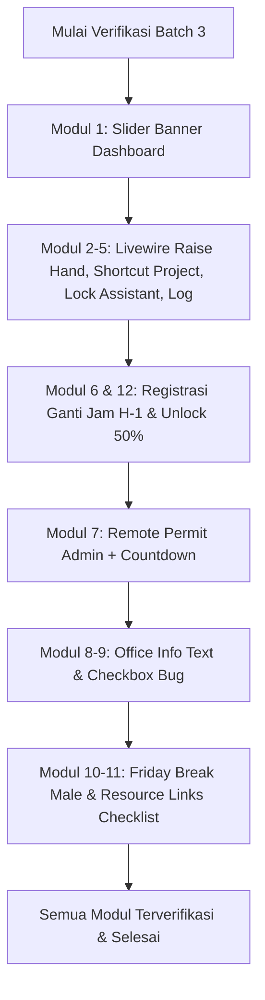

# 📋 Rencana Implementasi Sistem Baru (Batch 3) — Absen Djuragan

> Dokumen ini berisi spesifikasi teknis, arsitektur alur kerja, skema database, dan panduan langkah demi langkah (_step-by-step_) untuk **12 modul peningkatan sistem utama** pada aplikasi **Absen Djuragan**.  
> Disusun sebagai panduan kerja mandiri yang presisi, terstruktur, lengkap dengan referensi file, potongan kode (_code snippets_), penanganan _edge cases_, serta rencana verifikasi dan pengujian.

---

## 📑 Daftar Isi & Matriks Prioritas

| No  | Modul / Fitur                                                                                                                                                  | Prioritas |  Estimasi   |   Status   |
| :-- | :------------------------------------------------------------------------------------------------------------------------------------------------------------- | :-------: | :---------: | :--------: |
| 1   | [Header Banner Carousel / Slider pada Dashboard Pemagang](#1-header-banner-carousel--slider-pada-dashboard-pemagang)                                           | 🟡 Sedang |  2 - 3 Jam  | ✅ Selesai |
| 2   | [Popup Real-Time Livewire untuk Raise Hand & Pemberian Tugas](#2-popup-real-time-livewire-untuk-raise-hand--pemberian-tugas)                                   | 🔴 Tinggi |  3 - 4 Jam  | ✅ Selesai |
| 3   | [Shortcut Langsung Assign Project dari Raise Hand "Minta Tugas"](#3-shortcut-langsung-assign-project-dari-raise-hand-minta-tugas)                              | 🟡 Sedang |  2 - 3 Jam  | ✅ Selesai |
| 4   | [Pembatasan Aksi & Penyembunyian Tab History Raise Hand untuk Assistant Admin](#4-pembatasan-aksi--penyembunyian-tab-history-raise-hand-untuk-assistant-admin) | 🔴 Tinggi |    2 Jam    | ✅ Selesai |
| 5   | [Pencatatan Audit Trail (Activity Log) Selesai Raise Hand](#5-pencatatan-audit-trail-activity-log-selesai-raise-hand)                                          | 🟡 Sedang | 1.5 - 2 Jam | ✅ Selesai |
| 6   | [Alur Pra-Pendaftaran Ganti Jam (H-1) & Aturan Tampilan Jadwal](#6-alur-pra-pendaftaran-ganti-jam-h-1--aturan-tampilan-jadwal)                                 | 🔴 Tinggi |  5 - 6 Jam  | ✅ Selesai |
| 7   | [Aktivasi Izin Remote oleh Admin di Presensi dengan Countdown Livewire](#7-aktivasi-izin-remote-oleh-admin-di-presensi-dengan-countdown-livewire)              | 🔴 Tinggi |  3 - 4 Jam  | ✅ Selesai |
| 8   | [Pembersihan Teks Alamat & Kapasitas pada Modal Info & Libur](#8-pembersihan-teks-alamat--kapasitas-pada-modal-info--libur)                                    | 🟢 Rendah |    1 Jam    | ✅ Selesai |
| 9   | [Perbaikan Bug Checkbox Toggle pada Pengaturan Info & Libur](#9-perbaikan-bug-checkbox-toggle-pada-pengaturan-info--libur)                                     | 🟡 Sedang |   1.5 Jam   | ✅ Selesai |
| 10  | [Penyesuaian Jam Istirahat Hari Jumat untuk Pemagang Laki-Laki (Shalat Jumat)](#10-penyesuaian-jam-istirahat-hari-jumat-untuk-pemagang-laki-laki-shalat-jumat) | 🔴 Tinggi |  2 - 3 Jam  | ✅ Selesai |
| 11  | [Daftar Checklist Tautan Resource Divisi pada Sunting Anggota](#11-daftar-checklist-tautan-resource-divisi-pada-sunting-anggota)                               | 🟡 Sedang |  2 - 3 Jam  | ✅ Selesai |
| 12  | [Unlock Pulang Ganti Jam pada 50% & Pengurangan Hutang Proporsional](#12-unlock-pulang-ganti-jam-pada-50--pengurangan-hutang-proporsional)                     | 🔴 Tinggi |  3 - 4 Jam  | ✅ Selesai |

---

## 1. Header Banner Carousel / Slider pada Dashboard Pemagang

### 1.1. Latar Belakang & Kebutuhan

Saat ini header banner pada layout dashboard pemagang (`resources/views/users/layouts/main.blade.php`) hanya menampilkan satu gambar statis tunggal (`$appSetting->intern_banner_url` atau fallback ke `bg.jpg` dan ucapan ultah `bg2.jpg`). Diperlukan sistem slider / carousel banner yang:

1. Mendukung tampilan multi-banner bergantian secara otomatis (_auto-slide_ dengan durasi interval configurable, misal 5-7 detik).
2. Terdapat tombol kontrol navigasi (panah kiri/kanan) dan titik indikator (_dots indicator_) di bagian bawah banner.
3. Tetap mempertahankan banner khusus ucapan ulang tahun pemagang jika hari ini berulang tahun.
4. Mendukung pengelolaan daftar banner melalui Admin App Settings atau konfigurasi dinamis.

### 1.2. Analisis File & Perubahan Kode

- **File Terdampak:**
    - `app/Models/AppSetting.php` — Tambahkan field / accessor untuk multi banner images (JSON array atau relasi).
    - `resources/views/users/layouts/main.blade.php` — Ubah container header banner menjadi komponen slider Alpine.js dengan transisi smooth fade / slide.
    - `app/Http/Controllers/SettingController.php` & `resources/views/admin/pengaturan.blade.php` — Tambahkan input upload multi-banner.

### 1.3. Langkah Implementasi

1. **Pembaruan Skema Database / AppSetting:**
    - Tambahkan kolom `banner_slides` (`json`, nullable) pada tabel `app_settings` untuk menyimpan array nama file banner tambahan.
    ```php
    // database/migrations/2026_09_30_000001_add_banner_slides_to_app_settings.php
    Schema::table('app_settings', function (Blueprint $table) {
        if (!Schema::hasColumn('app_settings', 'banner_slides')) {
            $table->json('banner_slides')->nullable()->after('intern_banner');
        }
    });
    ```
2. **Komponen Carousel di `resources/views/users/layouts/main.blade.php`:**
    - Menggunakan Alpine.js (`x-data="{ currentSlide: 0, totalSlides: N, autoSlideInterval: null }"`) untuk mengelola transisi:
    ```blade
    <div x-data="{
        activeSlide: 0,
        slides: {{ json_encode($bannerSlides ?? [$appSetting->intern_banner_url ?? asset('img/bg.jpg')]) }},
        init() {
            if (this.slides.length > 1) {
                setInterval(() => {
                    this.activeSlide = (this.activeSlide + 1) % this.slides.length;
                }, 6000);
            }
        }
    }" class="relative h-[250px] w-full flex-shrink-0 overflow-hidden md:rounded-br-[40px]">
        <template x-for="(slide, index) in slides" :key="index">
            <div x-show="activeSlide === index"
                 x-transition:enter="transition ease-out duration-700"
                 x-transition:enter-start="opacity-0 transform scale-105"
                 x-transition:enter-end="opacity-100 transform scale-100"
                 x-transition:leave="transition ease-in duration-700"
                 x-transition:leave-start="opacity-100 transform scale-100"
                 x-transition:leave-end="opacity-0 transform scale-95"
                 class="absolute inset-0 w-full h-full">
                
            </div>
        </template>
        <!-- Dots Indicator -->
        <div x-show="slides.length > 1" class="absolute bottom-3 left-1/2 -translate-x-1/2 flex gap-1.5 z-20">
            <template x-for="(slide, index) in slides" :key="index">
                <button @click="activeSlide = index"
                        :class="activeSlide === index ? 'w-6 bg-white' : 'w-2 bg-white/50'"
                        class="h-2 rounded-full transition-all duration-300"></button>
            </template>
        </div>
        <!-- Welcome Text Overlay -->
        <div class="absolute inset-0 flex items-center justify-center z-10 p-2 md:p-4 pointer-events-none">
            <div class="typewriter text-xl md:text-3xl font-bold text-white text-center italic">
                <h1 id="typewriter-text"></h1>
            </div>
        </div>
    </div>
    ```

---

## 2. Popup Real-Time Livewire untuk Raise Hand & Pemberian Tugas

### 2.1. Latar Belakang & Kebutuhan

Ketika admin memberikan tanggapan balasan pada Raise Hand (`admin_response`), atau saat mentor memberikan tugas/project baru (`tugas diberikan`), pemagang harus mendapatkan pemberitahuan instan tanpa perlu me-refresh halaman secara manual.

- Notifikasi popup Livewire / modal responsif muncul otomatis saat ada update status / tanggapan baru dari admin.
- Polling Livewire reaktif (`wire:poll.5s` atau event dispatcher) memantau status `HandRaise` dan `DetailProjects` aktif pemagang.

### 2.2. File yang Terlibat

- `app/Livewire/AttdStatusButton.php` — Komponen Livewire utama di dashboard pemagang.
- `resources/views/livewire/attd-status-button.blade.php` — Modal popup Livewire untuk menampilkan pesan respon admin & tugas baru.
- `app/Http/Controllers/HandRaiseController.php` — Endpoint tanggapan admin yang memicu update data.

### 2.3. Langkah Implementasi

1. **Tambahkan Properti & Deteksi Perubahan di `AttdStatusButton.php`:**

    ```php
    public ?string $lastAdminResponse = null;
    public bool $showResponseModal = false;
    public ?string $newAssignedTaskTitle = null;
    public bool $showNewTaskModal = false;

    public function checkRealtimeNotifications(): void
    {
        if (!$this->user) return;
        $userId = $this->user->id ?? auth()->id();

        // 1. Cek tanggapan baru raise hand
        $latestResponse = \App\Models\HandRaise::where('user_id', $userId)
            ->whereNotNull('admin_response')
            ->latest('updated_at')
            ->first();

        if ($latestResponse && $latestResponse->admin_response !== session('last_notified_response_'.$latestResponse->id)) {
            $this->currentHandRaise = $latestResponse;
            $this->showResponseModal = true;
            session(['last_notified_response_'.$latestResponse->id => $latestResponse->admin_response]);
        }

        // 2. Cek tugas baru yang diberikan
        $internId = $this->user->intern?->id;
        if ($internId) {
            $latestTask = \App\Models\DetailProjects::where('intern_id', $internId)
                ->whereDate('created_at', today())
                ->latest('id')
                ->with('project.nameProject')
                ->first();

            if ($latestTask && !session('notified_task_'.$latestTask->id)) {
                $this->newAssignedTaskTitle = $latestTask->project?->nameProject?->name ?? 'Tugas Baru';
                $this->showNewTaskModal = true;
                session(['notified_task_'.$latestTask->id => true]);
            }
        }
    }
    ```

2. **Tampilan Popup Modal pada `resources/views/livewire/attd-status-button.blade.php`:**
    - Tambahkan modal dialog yang muncul jika `$showResponseModal` atau `$showNewTaskModal` bernilai `true`.
    - Tombol konfirmasi "Mengerti" menutup modal dan mereset status.

---

## 3. Shortcut Langsung Assign Project dari Raise Hand "Minta Tugas"

### 3.1. Latar Belakang & Kebutuhan

Pada kartu Raise Hand dengan tipe **Permintaan Tugas Baru** (`new_task`), tombol shortcut **"Setting Project"** saat ini hanya mengarahkan ke halaman `route('admin.pengaturan.project')` tanpa konteks. Admin harus mencari dan memilih nama pemagang secara manual.  
**Kebutuhan:**

- Mengklik tombol "Setting Project" pada kartu "Minta Tugas" akan langsung membuka modal _Assign Project_ dengan dropdown nama pemagang sudah otomatis terpilih sesuai pemagang yang mengajukan.

### 3.2. File yang Terlibat

- `resources/views/admin/partials/raise-hand-table-body.blade.php` (baris 651)
- `app/Http/Controllers/SettingProjectController.php`
- `resources/views/admin/pengaturan-project.blade.php`

### 3.3. Langkah Implementasi

1. **Update Link pada Raise Hand Table Body:**
    ```blade
    <!-- resources/views/admin/partials/raise-hand-table-body.blade.php -->
    <a href="{{ route('admin.pengaturan.project', ['intern_id' => $handRaise->user->intern?->id, 'action' => 'assign_task', 'raise_id' => $handRaise->id]) }}"
        class="inline-flex items-center gap-1.5 px-3 py-1.5 bg-purple-50 hover:bg-purple-100 text-purple-700 text-xs font-bold rounded-xl border border-purple-200 transition cursor-pointer whitespace-nowrap shadow-2xs"
        title="Langsung Berikan Project ke Pemagang Ini">
        <i class="fa-solid fa-folder-plus text-[11px] text-purple-600"></i>
        <span>Beri Tugas Sekarang</span>
    </a>
    ```
2. **Penerimaan Parameter di `SettingProjectController.php`:**
    - Tangkap query parameter `intern_id`, `action`, dan `raise_id` pada method `adminSettingProjectView()` lalu kirimkan ke view.
3. **Auto-Trigger Modal & Pre-Select di `resources/views/admin/pengaturan-project.blade.php`:**
    - Tambahkan script JavaScript di blade view:

    ```javascript
    document.addEventListener("DOMContentLoaded", function () {
        const urlParams = new URLSearchParams(window.location.search);
        const targetInternId = urlParams.get("intern_id");
        const action = urlParams.get("action");

        if (action === "assign_task" && targetInternId) {
            const internSelect = document.getElementById("intern_id");
            if (internSelect) {
                internSelect.value = targetInternId;
                // Trigger modal project assignment
                const modal = document.getElementById("addProjectModal");
                if (modal) modal.classList.remove("hidden");
            }
        }
    });
    ```

---

## 4. Pembatasan Aksi & Penyembunyian Tab History Raise Hand untuk Assistant Admin

### 4.1. Latar Belakang & Kebutuhan

Assistant Admin (`role_id: 6`) bertindak sebagai pendamping dan pemantau aktivitas, namun tidak memiliki hak untuk memberikan penilaian, menyetujui tugas, atau merespons tindakan administratif pada modul Raise Hand.  
**Kebutuhan:**

1. **Sembunyikan Tab "4. History Selesai"** pada `RaiseHandManager` jika pengguna yang login adalah Assistant Admin.
2. **Kunci Semua Tombol Aksi** pada semua kartu (Bertanya, Minta Tugas, Presentasi) menjadi _view-only_ atau digantikan badge keterangan `"Hak Akses Admin"`.
3. Validasi backend di `HandRaiseController` memastikan jika pengguna dengan `role_id == 6` memanggil endpoint konfirmasi/penyelesaian, aksi tersebut ditolak dengan pesan error yang sesuai.

### 4.2. File yang Terlibat

- `app/Livewire/Admin/RaiseHandManager.php`
- `resources/views/livewire/admin/raise-hand-manager.blade.php`
- `resources/views/admin/partials/raise-hand-table-body.blade.php`
- `app/Http/Controllers/HandRaiseController.php`

### 4.3. Langkah Implementasi

1. **Filter Tab di `app/Livewire/Admin/RaiseHandManager.php`:**
    ```php
    public function switchTab(string $tab): void
    {
        // Jika Assistant Admin mencoba akses tab history, paksa kembali ke 'question'
        if (auth()->check() && (int) auth()->user()->role_id === 6 && $tab === 'history') {
            $this->activeTab = 'question';
            return;
        }
        if (in_array($tab, ['question', 'new_task', 'presentation', 'history'])) {
            $this->activeTab = $tab;
            if ($tab === 'history') $this->resetPage();
        }
    }
    ```
2. **Sembunyikan Tab di `resources/views/livewire/admin/raise-hand-manager.blade.php`:**
    ```blade
    @if(!auth()->check() || (int) auth()->user()->role_id !== 6)
    <!-- Tab 4: History Selesai (Hanya untuk Admin / Superadmin) -->
    <button type="button" wire:click="switchTab('history')" ...>
        <i class="fa-solid fa-clipboard-check shrink-0"></i>
        <span class="truncate">4. History Selesai</span>
        <span class="...">{{ $countDone }}</span>
    </button>
    @endif
    ```
3. **Kunci Tombol Aksi di `resources/views/admin/partials/raise-hand-table-body.blade.php`:**
    - Periksa variabel `$isAssistantAdmin = auth()->check() && (int) auth()->user()->role_id === 6;`.
    - Jika `$isAssistantAdmin === true`, tampilkan badge abu/kuning:
    ```blade
    <span class="inline-flex items-center gap-1.5 px-3 py-1.5 rounded-xl text-xs font-semibold bg-slate-100 text-slate-600 border border-slate-200">
        <i class="fa-solid fa-lock text-slate-400 text-xs"></i>
        <span>Hak Akses Admin</span>
    </span>
    ```
4. **Proteksi Endpoint di `HandRaiseController.php`:**
    ```php
    if (auth()->check() && (int) auth()->user()->role_id === 6) {
        return redirect()->back()->with('error', 'Aksi ini hanya dapat dilakukan oleh Admin / Pembimbing Utama.');
    }
    ```

---

## 5. Pencatatan Audit Trail (Activity Log) Selesai Raise Hand

### 5.1. Latar Belakang & Kebutuhan

Setiap kali sesi Raise Hand (baik pertanyaan, permintaan tugas baru, maupun sesi presentasi) diselesaikan — baik ditandai selesai oleh admin ataupun pemagang — tindakan tersebut harus tercatat secara permanen di `SystemActivityLog` melalui `ActivityLogger`.

### 5.2. File yang Terlibat

- `app/Helper/ActivityLogger.php`
- `app/Http/Controllers/HandRaiseController.php`
- `app/Livewire/Admin/RaiseHandManager.php`

### 5.3. Langkah Implementasi

Tambahkan panggilan `ActivityLogger::log(...)` pada setiap cabang resolusi di `HandRaiseController.php`:

```php
// Pada method confirmComplete / resolveHandRaise:
\App\Helper\ActivityLogger::log(
    'RESOLVE',
    'Raise Hand',
    "Penyelesaian permintaan [{$handRaise->type_label}] untuk pemagang {$userName} oleh " . (auth()->user()->profile->full_name ?? auth()->user()->username),
    [
        'hand_raise_id' => $handRaise->id,
        'user_id' => $handRaise->user_id,
        'type' => $handRaise->type,
        'rating' => $handRaise->performance_rating,
        'admin_response' => $handRaise->admin_response,
        'resolved_by' => auth()->id(),
    ]
);
```

---

## 6. Alur Pra-Pendaftaran Ganti Jam (H-1) & Aturan Tampilan Jadwal

### 6.1. Latar Belakang & Kebutuhan

Sistem Ganti Jam (_Change Time_) disempurnakan dengan alur registrasi resmi:

1. **Pendaftaran Dibuka Setiap Hari (Minimal H-1):** Pemagang yang memiliki hutang jam wajib mendaftarkan rencana ganti jam minimal H-1 sebelum tanggal pelaksanaan.
2. **Pemberitahuan & Validasi Kuota Pendaftaran:** Pemagang hanya dapat memiliki **1 pendaftaran aktif** yang belum selesai. Jika pendaftaran sebelumnya masih berstatus `pending` atau `approved` dan belum dijalankan, pendaftaran baru diblokir.
3. **Persetujuan & Penjadwalan oleh Admin:** Admin meninjau permohonan, menetapkan shift & kantor yang diizinkan, lalu menyetujui (_approve_) atau menolak (_reject_).
4. **Aturan Tampilan Jadwal pada Hari Minggu & Hari Libur:**
    - Jika pemagang **telah mendaftar dan disetujui admin** untuk ganti jam pada hari Minggu / hari libur, jadwal reguler di-hide dan hanya jadwal sesi ganti jam yang ditampilkan di dashboard pemagang.
    - Jika pemagang **belum disetujui / tidak mendaftar**, dashboard menampilkan informasi hari libur dan tombol presensi ganti jam terkunci.

### 6.2. Skema Database (`change_time_registrations`)

Buat tabel migrasi `change_time_registrations`:

```php
// database/migrations/2026_09_30_000002_create_change_time_registrations_table.php
Schema::create('change_time_registrations', function (Blueprint $table) {
    $table->id();
    $table->foreignId('intern_id')->constrained('interns')->onDelete('cascade');
    $table->date('requested_date'); // Tanggal rencana ganti jam (minimal H+1 saat didaftarkan)
    $table->foreignId('shift_id')->nullable()->constrained('shifts')->nullOnDelete();
    $table->foreignId('office_id')->nullable()->constrained('offices')->nullOnDelete();
    $table->integer('estimated_minutes')->default(0);
    $table->text('reason')->nullable();
    $table->enum('status', ['pending', 'approved', 'rejected', 'completed', 'cancelled'])->default('pending');
    $table->text('admin_notes')->nullable();
    $table->foreignId('approved_by')->nullable()->constrained('users')->nullOnDelete();
    $table->timestamp('approved_at')->nullable();
    $table->timestamps();
});
```

### 6.3. File yang Terlibat

- `app/Models/ChangeTimeRegistration.php` — Model baru dengan relasi `intern`, `shift`, `office`, `approver`.
- `app/Services/AttendanceService.php` — Penyesuaian `attendanceStatus()` untuk menampilkan shift ganti jam dan menyembunyikan shift reguler pada hari libur/Minggu jika pendaftaran ter-ACC.
- `app/Http/Controllers/ChangeTimeRegistrationController.php` — CRUD pendaftaran pemagang & approval admin.
- `resources/views/users/index.blade.php` & `resources/views/livewire/attd-status-button.blade.php` — Form pendaftaran ganti jam H-1 dan popup status jadwal ganti jam via Livewire.

---

## 7. Aktivasi Izin Remote oleh Admin di Presensi dengan Countdown Livewire

### 7.1. Latar Belakang & Kebutuhan

Terkadang pemagang sedang berada di kantor atau lapangan dan memerlukan izin mendadak (Izin Keluar Keperluan, Izin Shalat, atau Izin Toilet) namun terkendala jaringan/perangkat.  
**Kebutuhan:**

1. Admin dapat mengaktifkan izin secara remote untuk pemagang langsung dari tabel presensi (`resources/views/admin/presensi.blade.php`) melalui aksi tombol cepat.
2. Ketika admin memicu aktivasi izin, sistem membuat `PermitLog` aktif untuk pemagang tersebut.
3. Dashboard pemagang secara instan mendeteksi status izin aktif melalui Livewire reactive polling / event dan memunculkan modal _countdown timer_ berjalan sesuai batas durasi yang ditentukan.

### 7.2. File yang Terlibat

- `resources/views/admin/presensi.blade.php` — Tambahkan tombol dropdown aksi "Aktivasi Izin Remote" (Keluar, Shalat, Toilet) pada kolom aksi presensi.
- `app/Http/Controllers/AdminController.php` atau `app/Http/Controllers/PermitController.php` — Method `remoteActivatePermit()`.
- `app/Livewire/AttdStatusButton.php` & `resources/views/livewire/attd-status-button.blade.php` — Komponen Livewire yang menampilkan countdown timer izin aktif.

### 7.3. Langkah Implementasi

1. **Endpoint Backend Aktivasi Izin Remote:**

    ```php
    public function remoteActivatePermit(Request $request)
    {
        $request->validate([
            'intern_id' => 'required|exists:interns,id',
            'type' => 'required|in:leave,prayer,toilet',
            'duration_minutes' => 'nullable|integer|min:1|max:180',
            'description' => 'nullable|string|max:255',
        ]);

        $todayAttendance = Attendance::firstOrCreate(
            ['intern_id' => $request->intern_id, 'date' => today()],
            ['start_time' => now()->format('H:i:s'), 'keterangan' => 'Presensi oleh Admin']
        );

        $duration = $request->duration_minutes ?? ($request->type === 'leave' ? 60 : 30);

        $permit = PermitLog::create([
            'attendance_id' => $todayAttendance->id,
            'type' => $request->type,
            'description' => $request->description ?: 'Izin diaktifkan secara remote oleh Admin',
            'authorized_by' => auth()->id(),
            'start_time' => now(),
            'agreed_duration_minutes' => $duration,
            'approval_status' => 'approved',
        ]);

        ActivityLogger::log('CREATE', 'Permit', "Admin mengaktifkan izin remote [{$request->type}] ({$duration} menit) untuk pemagang ID {$request->intern_id}");

        return response()->json(['success' => true, 'message' => 'Izin berhasil diaktifkan secara remote!']);
    }
    ```

2. **Aksi Tombol di `resources/views/admin/presensi.blade.php`:**
    - Menambahkan tombol popup modal di setiap baris presensi mahasiswa untuk memilih tipe izin dan durasi.
3. **Sinkronisasi Livewire Pemagang di `AttdStatusButton.php`:**
    - Komponen Livewire mendeteksi `$activePermit = PermitLog::whereHas('attendance', ...)->whereNull('end_time')->latest()->first();` dan otomatis membuka modal countdown timer.

---

## 8. Pembersihan Teks Alamat & Kapasitas pada Modal Info & Libur

### 8.1. Latar Belakang & Kebutuhan

Pada modal **Info & Libur** di dashboard pemagang (`resources/views/users/index.blade.php` baris 636-641), terdapat teks statis alamat kantor dan kapasitas (`&bull; Kapasitas: X orang`) yang tampak kurang rapi jika data tidak tersedia atau tidak relevan.  
**Kebutuhan:**

- Bersihkan teks tampilan agar hanya menampilkan alamat jika tersedia dengan format bersih, dan hapus teks kapasitas yang tidak diperlukan.

### 8.2. File yang Terlibat

- `resources/views/users/index.blade.php` (baris 630-645)

### 8.3. Perubahan Kode

```blade
<!-- resources/views/users/index.blade.php -->
<div class="bg-indigo-50 border border-indigo-200 rounded-xl p-4 flex items-start space-x-3">
    <div class="text-indigo-600 text-xl mt-0.5"><i class="fas fa-building"></i></div>
    <div>
        <h4 class="font-bold text-indigo-900 text-sm">
            Peraturan Penempatan: {{ $userOffice->name ?? 'Kantor Djuragan' }}
        </h4>
        @if(!empty($userOffice->address))
        <p class="text-xs text-indigo-700 mt-0.5 flex items-center gap-1.5">
            <i class="fas fa-location-dot text-indigo-500"></i>
            <span>{{ $userOffice->address }}</span>
        </p>
        @endif
    </div>
</div>
```

---

## 9. Perbaikan Bug Checkbox Toggle pada Pengaturan Info & Libur

### 9.1. Latar Belakang & Kebutuhan

Pada halaman pengaturan SOP, Aturan Kantor, dan Jadwal Piket (`resources/views/admin/pengaturan-holiday.blade.php`), checkbox _"Terapkan tautan ini ke semua lokasi kantor"_ (`apply_all`) mengalami kendala saat di-uncheck atau saat memilih kantor spesifik: nilainya tidak terkirim atau tetap menimpa semua kantor secara global.

### 9.2. File yang Terlibat

- `resources/views/admin/pengaturan-holiday.blade.php`
- `app/Http/Controllers/SettingHolidayController.php` (method `updateOfficeInfo`)

### 9.3. Langkah Implementasi & Perbaikan

1. **Perbaikan Input Checkbox di `pengaturan-holiday.blade.php`:**
    - Gunakan hidden input default `value="0"` sebelum checkbox agar saat uncheck nilai `0` tetap terkirim secara tepat.
    ```blade
    <div class="flex items-center">
        <input type="hidden" name="apply_all" value="0">
        <input type="checkbox" id="sop_apply_all" name="apply_all" value="1"
            class="h-4 w-4 text-blue-600 rounded border-gray-300 focus:ring-blue-500"
            {{ old('apply_all', '1') == '1' ? 'checked' : '' }}>
        <label for="sop_apply_all" class="ml-2 text-xs font-medium text-gray-700 cursor-pointer">
            Terapkan tautan SOP ini ke semua lokasi kantor
        </label>
    </div>
    ```
2. **Penyempurnaan Logika di `SettingHolidayController.php`:**

    ```php
    $applyAll = $request->boolean('apply_all') || $request->input('office_id') === 'all';
    $officeId = $request->input('office_id');

    if (!empty($dataToUpdate)) {
        if ($applyAll) {
            Office::query()->update($dataToUpdate);
        } elseif ($officeId && is_numeric($officeId)) {
            $office = Office::findOrFail($officeId);
            $office->update($dataToUpdate);
        }
    }
    ```

---

## 10. Penyesuaian Jam Istirahat Hari Jumat untuk Pemagang Laki-Laki (Shalat Jumat)

### 10.1. Latar Belakang & Kebutuhan

Pada hari Jumat (`date('N') == 5`), pemagang laki-laki (`gender == 'L'` / `'Laki-laki'`) memiliki kewajiban Shalat Jumat.  
**Kebutuhan:**

1. Khusus hari Jumat, jendela waktu istirahat pemagang laki-laki disesuaikan secara otomatis menjadi **11:40 - 12:40 WIB** (durasi 60 menit), mengesampingkan jadwal istirahat default shift jika berbeda.
2. Pemagang perempuan tetap mengikuti jadwal istirahat standar shift masing-masing.

### 10.2. File yang Terlibat

- `app/Services/AttendanceService.php`
- `app/Services/Attendance/State/AttendanceBreakStartState.php`
- `app/Services/ShiftService.php`

### 10.3. Langkah Implementasi

Tambahkan helper method deteksi jendela istirahat Jumat di `AttendanceBreakStartState.php` dan `AttendanceService.php`:

```php
// Helper untuk menentukan window istirahat dinamis
private function getEffectiveBreakWindow($shift, $user): array
{
    $startBreak = $shift->start_break_time;
    $endBreak = $shift->end_break_time;
    $breakMins = (int) ($shift->break_time_in_minute ?? 60);

    $isFriday = \Carbon\Carbon::now('Asia/Jakarta')->isFriday();
    $gender = strtolower($user?->profile?->gender ?? '');
    $isMale = in_array($gender, ['l', 'laki-laki', 'male', 'pria']);

    if ($isFriday && $isMale) {
        $startBreak = '11:40:00';
        $endBreak = '12:40:00';
        $breakMins = 60;
    }

    return [$startBreak, $endBreak, $breakMins];
}
```

---

## 11. Daftar Checklist Tautan Resource Divisi pada Sunting Anggota

### 11.1. Latar Belakang & Kebutuhan

Pada halaman **Sunting Anggota** (`resources/views/admin/sunting-anggota.blade.php`), admin perlu fleksibilitas untuk mengaktifkan atau menonaktifkan platform tautan tugas (misal: Google Drive, GitHub, Figma, Social Media Accounts, Trello/Notion, dll.) menggunakan checklist interaktif sehingga form menjadi ringkas dan tepat sasaran.

### 11.2. File yang Terlibat

- `resources/views/admin/sunting-anggota.blade.php`
- `app/Http/Controllers/InternController.php`
- `app/Models/InternAccount.php`

### 11.3. Langkah Implementasi

1. **Tambahkan Checklist Toggle Platform di Blade View:**
    ```blade
    <div class="mb-4 p-3 bg-gray-50 rounded-xl border border-gray-200">
        <span class="text-xs font-bold text-gray-700 uppercase tracking-wider block mb-2">
            <i class="fa-solid fa-list-check text-indigo-600 mr-1"></i> Aktifkan Resource Platform:
        </span>
        <div class="grid grid-cols-2 sm:grid-cols-4 gap-2 text-xs">
            <label class="flex items-center gap-2 cursor-pointer">
                <input type="checkbox" id="toggle_gdrive" class="rounded text-indigo-600" checked onchange="document.getElementById('section_gdrive').classList.toggle('hidden', !this.checked)">
                <span>Google Drive</span>
            </label>
            <label class="flex items-center gap-2 cursor-pointer">
                <input type="checkbox" id="toggle_github" class="rounded text-indigo-600" {{ $isProgrammer ? 'checked' : '' }} onchange="document.getElementById('division-form-programmer').classList.toggle('hidden', !this.checked)">
                <span>GitHub & Gmail</span>
            </label>
            <label class="flex items-center gap-2 cursor-pointer">
                <input type="checkbox" id="toggle_figma" class="rounded text-indigo-600" {{ $isUiUx ? 'checked' : '' }} onchange="document.getElementById('division-form-uiux').classList.toggle('hidden', !this.checked)">
                <span>Figma Workspace</span>
            </label>
            <label class="flex items-center gap-2 cursor-pointer">
                <input type="checkbox" id="toggle_sosmed" class="rounded text-indigo-600" {{ $isSosmed ? 'checked' : '' }} onchange="document.getElementById('division-form-sosmed').classList.toggle('hidden', !this.checked)">
                <span>Akun Sosmed</span>
            </label>
        </div>
    </div>
    ```

---

## 12. Unlock Pulang Ganti Jam pada 50% & Pengurangan Hutang Proporsional

### 12.1. Latar Belakang & Kebutuhan

Sebelumnya, presensi pulang ganti jam hanya diizinkan jika pemagang telah menyelesaikan **100%** target hutang jam kerja (`$totalMinutes >= $targetDebtMinutes`).  
**Aturan Baru:**

1. **Batas Minimum 50%:** Tombol dan aksi _"Presensi Pulang Ganti Jam"_ terbuka (_unlocked_) setelah pemagang menyelesaikan minimal **50%** dari total target hutang jam pada sesi tersebut (`$totalMinutes >= ceil($targetDebtMinutes * 0.5)`).
2. **Pengurangan Hutang Proporsional:**
    - Jika pemagang pulang sebelum 100% lunas (antara 50% hingga 99%), data sesi ganti jam tersimpan dengan durasi kerja aktual (`$totalMinutes`).
    - Sisa hutang berkurang secara proporsional sesuai menit kerja aktual yang diselesaikan, dan sisa hutang yang belum selesai dapat diganti pada sesi/hari berikutnya.
    - Jika telah mencapai 100% atau lebih (`$totalMinutes >= $targetDebtMinutes`), status jadwal target otomatis diset lunas (`fulfillDebtScheduleAttendance`).

### 12.2. File yang Terlibat

- `app/Services/Attendance/State/AdjustableOutState.php` (baris 103-125)
- `app/Livewire/AttdStatusButton.php` (baris 520 & 546)
- `app/Helper/TimeHelper.php`

### 12.3. Langkah Implementasi

1. **Pembaruan Validasi di `app/Services/Attendance/State/AdjustableOutState.php`:**

    ```php
    // Hitung ambang batas 50% dari target hutang
    $minAllowedMinutes = (int) ceil($targetDebtMinutes * 0.5);

    // Validasi 1: Belum boleh pulang jika durasi kerja ganti jam belum mencapai 50%
    if ($targetDebtMinutes > 0 && $totalMinutes < $minAllowedMinutes) {
        $kurangMenit = $minAllowedMinutes - $totalMinutes;
        $minHours = floor($minAllowedMinutes / 60);
        $minMins = $minAllowedMinutes % 60;
        $currHours = floor($totalMinutes / 60);
        $currMins = $totalMinutes % 60;
        $kurangHours = floor($kurangMenit / 60);
        $kurangMinsRemainder = $kurangMenit % 60;

        $kurangStr = $kurangHours > 0
            ? "{$kurangHours} Jam {$kurangMinsRemainder} Menit"
            : "{$kurangMinsRemainder} Menit";

        return new ActionResult(
            false,
            "Belum dapat presensi pulang ganti jam. Minimal durasi kerja ganti jam adalah 50% dari total hutang ({$minHours} Jam {$minMins} Menit). Durasi kerja Anda saat ini baru {$currHours} Jam {$currMins} Menit (Kurang {$kurangStr} lagi).",
            null
        );
    }
    ```

2. **Pembaruan Kondisi Tombol di `app/Livewire/AttdStatusButton.php`:**
    ```php
    // Boleh presensi pulang jika sudah mencapai minimal 50% target hutang
    $minTargetMinutes = (int) ceil($targetDebtMinutes * 0.5);
    $canClockOutGantiJam = ($targetDebtMinutes <= 0) || ($gantiJamWorkedMinutes >= $minTargetMinutes);
    $remainingGantiJamMinutes = max(0, $targetDebtMinutes - $gantiJamWorkedMinutes);
    ```

---

## 🧪 Rencana Pengujian & Verifikasi



1. **Uji Fungsionalitas Modul 1 (Slider Banner):**
    - Buka dashboard pemagang, verifikasi slider banner bertransisi otomatis dan indikator dots berfungsi.
2. **Uji Modul 2 - 5 (Raise Hand Ecosystem):**
    - Ajukan Raise Hand "Minta Tugas", login sebagai Admin, klik "Beri Tugas Sekarang" dan pastikan modal Assign Project terbuka dengan pemagang terpilih.
    - Login sebagai Assistant Admin, pastikan Tab History hilang dan semua tombol aksi berstatus lock.
    - Selesaikan pertanyaan / tugas, verifikasi entri tercatat di tabel `system_activity_logs`.
3. **Uji Modul 6 & 12 (Alur Ganti Jam & 50% Unlock):**
    - Daftarkan ganti jam H-1 via dashboard pemagang.
    - Login admin dan setujui jadwal. Buka dashboard pemagang pada tanggal yang disetujui, pastikan shift reguler tersembunyi dan shift ganti jam tampil.
    - Check-in ganti jam, tunggu/simulasikan hingga mencapai 50% durasi hutang, pastikan tombol "Pulang Ganti Jam" aktif dan hutang terpotong secara proporsional.
4. **Uji Modul 7 (Aktivasi Izin Remote):**
    - Dari tabel presensi admin, klik tombol aktivasi Izin Keluar (30 menit).
    - Pastikan dashboard pemagang langsung menampilkan modal countdown 30 menit tanpa refresh.
5. **Uji Modul 10 (Istirahat Jumat Laki-Laki):**
    - Set sistem ke hari Jumat (`Carbon::setTestNow`), periksa pemagang laki-laki mendapat jam istirahat 11:40 - 12:40 WIB.
