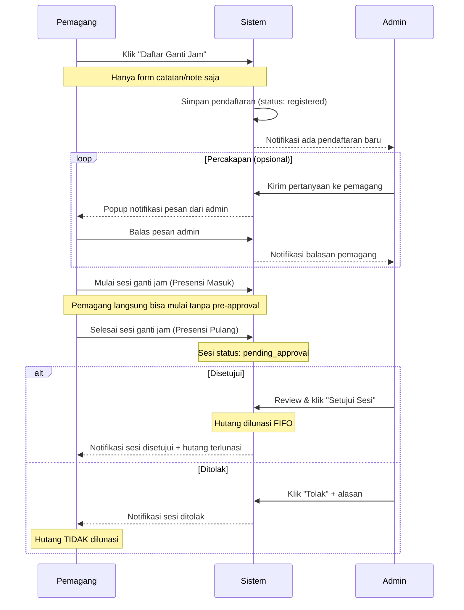
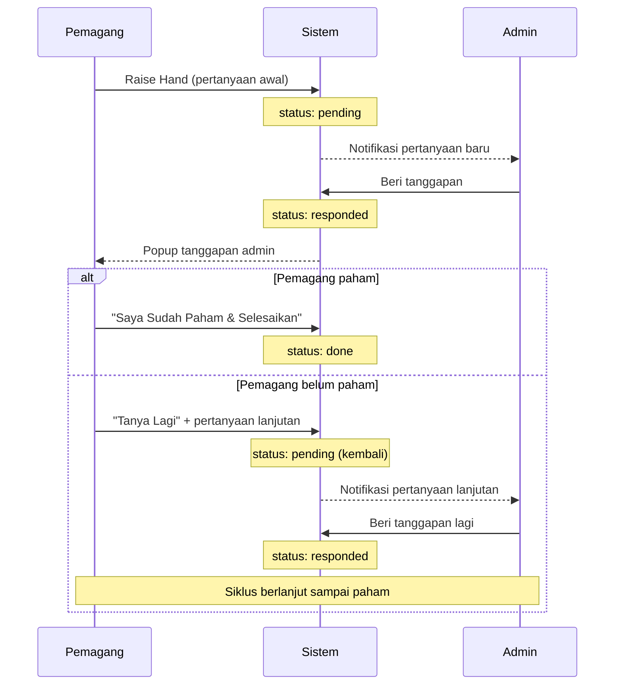
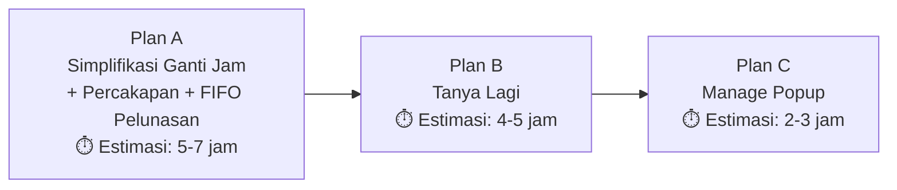

# NEW4_PLANS — Rencana Perubahan & Fitur Baru (Batch 4)

> **Dibuat**: 1 Oktober 2026
> **Status**: Draft — Menunggu Review & Persetujuan
> **Cakupan**: 2 perubahan fitur + 1 fitur baru

---

## Daftar Isi

1. [Plan A — Simplifikasi Ganti Jam (Tanpa Form Pendaftaran)](#plan-a--simplifikasi-ganti-jam)
2. [Plan B — Raise Hand Bantuan: Tanya Lagi (Follow-up Question)](#plan-b--raise-hand-tanya-lagi)
3. [Plan C — Fitur Baru: Manage Popup (Pengaturan Refresh Livewire Admin)](#plan-c--manage-popup)
4. [Ringkasan Dampak & Urutan Pengerjaan](#ringkasan)

---

## Plan A — Simplifikasi Ganti Jam

### A.1 Tujuan

Menyederhanakan alur pendaftaran ganti jam agar pemagang **hanya mengisi catatan/note saja** tanpa harus memilih shift, kantor, atau jam hutang. Semua form pendaftaran di-hide (baik sisi pemagang maupun admin). Hasil ganti jam tetap harus dikonfirmasi oleh Admin/Superadmin.

### A.2 Kondisi Saat Ini

```
┌─────────────────────────────────────────────────────────┐
│                ALUR SAAT INI (KOMPLEKS)                  │
├─────────────────────────────────────────────────────────┤
│ Pemagang mengisi form:                                  │
│  ├── Pilih tanggal rencana pelaksanaan                  │
│  ├── Pilih shift ganti jam (dropdown)                   │
│  ├── Pilih kantor/lokasi (dropdown)                     │
│  ├── Pilih jam hutang / target jadwal (radio/checkbox)  │
│  ├── Estimasi durasi (menit)                            │
│  └── Catatan/alasan (textarea)                          │
│                                                         │
│ Admin mereview & approve/reject:                        │
│  ├── Set/ubah tanggal pelaksanaan                       │
│  ├── Set/ubah shift                                     │
│  ├── Set/ubah kantor                                    │
│  └── Catatan admin                                      │
└─────────────────────────────────────────────────────────┘
```

**File terkait saat ini:**

| File                                                                                                                                                           | Fungsi                                                                                                                                                                     |
| -------------------------------------------------------------------------------------------------------------------------------------------------------------- | -------------------------------------------------------------------------------------------------------------------------------------------------------------------------- |
| [`app/Models/ChangeTimeRegistration.php`](file:///d:/laragon/www/absen-djuragan/app/Models/ChangeTimeRegistration.php)                                         | Model: `intern_id`, `requested_date`, `shift_id`, `office_id`, `target_schedule_ids`, `estimated_minutes`, `reason`, `status`, `admin_notes`, `approved_by`, `approved_at` |
| [`app/Models/ChangeTimeSetting.php`](file:///d:/laragon/www/absen-djuragan/app/Models/ChangeTimeSetting.php)                                                   | Setting: `restrict_to_holidays`, `allowed_shift_ids`, `allowed_office_ids`, `default_office_id`                                                                            |
| [`app/Http/Controllers/ChangeTimeRegistrationController.php`](file:///d:/laragon/www/absen-djuragan/app/Http/Controllers/ChangeTimeRegistrationController.php) | Controller: `store()`, `cancel()`, `adminApprove()`, `adminReject()`, `adminDestroy()`                                                                                     |
| [`resources/views/users/index.blade.php`](file:///d:/laragon/www/absen-djuragan/resources/views/users/index.blade.php)                                         | View pemagang: form pendaftaran ganti jam                                                                                                                                  |
| [`resources/views/admin/ganti-jam/index.blade.php`](file:///d:/laragon/www/absen-djuragan/resources/views/admin/ganti-jam/index.blade.php)                     | View admin: tabel & modal approve/reject                                                                                                                                   |
| [`public/js/user/index.js`](file:///d:/laragon/www/absen-djuragan/public/js/user/index.js)                                                                     | JS validation: `submitChangeTimeForm()` (L637–731)                                                                                                                         |

**Lokasi form pemagang di `users/index.blade.php` (detail):**

| Bagian                             | Baris          | Keterangan                                   |
| ---------------------------------- | -------------- | -------------------------------------------- |
| Trigger tombol "Ganti Jam"         | L248–252       | `onclick="openChangeTimeModal()"`            |
| Banner status pending              | L264–287       | Tampilan saat menunggu review admin          |
| Banner status approved             | L288–305       | Tampilan saat sudah disetujui                |
| Modal `#changeTimeModal`           | L934–1494      | Container modal keseluruhan                  |
| State A: Sudah disetujui           | L937–1088      | Info jadwal yang disetujui                   |
| State B: Menunggu persetujuan      | L1089–1191     | Pending + form batal                         |
| **State C: Form pendaftaran baru** | **L1193–1487** | **Form yang akan disederhanakan**            |
| — Notice banner                    | L1224–1235     | "Tanggal Ditentukan Admin"                   |
| — Hidden fields                    | L1256–1260     | `change_time_mode`, `change_time_hours`, dll |
| — **Pilih target hutang jam**      | **L1262–1336** | **→ DI-HIDE**                                |
| — **Pilih shift (dropdown)**       | **L1340–1394** | **→ DI-HIDE**                                |
| — **Pilih kantor (dropdown)**      | **L1397–1451** | **→ DI-HIDE**                                |
| — Catatan/alasan (textarea)        | L1454–1461     | **→ TETAP (jadi required)**                  |

**Lokasi admin approve modal di `admin/ganti-jam/index.blade.php`:**

| Bagian                           | Baris    | Keterangan                       |
| -------------------------------- | -------- | -------------------------------- |
| Modal approve `#approveRegModal` | L749–813 | Admin isi tanggal, shift, kantor |
| Modal reject `#rejectRegModal`   | L818–857 | Admin isi alasan                 |
| Modal delete `#deleteRegModal`   | L862–927 | Konfirmasi hapus                 |

### A.3 Perubahan yang Direncanakan

#### A.3.1 Alur Baru (Sederhana + Approve di Akhir Sesi)



> [!IMPORTANT]
> **Perbedaan utama dari sistem sebelumnya:**
> 1. Admin **TIDAK** mengisi tanggal, shift, atau kantor
> 2. **TIDAK ADA pre-approval** — pemagang langsung bisa mulai sesi setelah mendaftar
> 3. Percakapan digunakan untuk klarifikasi rencana (opsional)
> 4. **Approval dipindah ke akhir** — admin menyetujui sesi ganti jam yang **sudah selesai** dikerjakan pemagang
> 5. Hutang baru dilunasi setelah admin approve sesi

#### A.3.2 Aturan Pelunasan Hutang (BARU)

Hutang dilunasi **hanya setelah admin menyetujui sesi** ganti jam yang sudah diselesaikan:

| Aturan | Detail |
|--------|--------|
| **Maks 1 sesi per hari** | Pemagang hanya bisa menjalankan 1 sesi ganti jam dalam 1 hari kalender |
| **Maks pelunasan per sesi** | Maksimal **7 jam 15 menit** (1 shift penuh = 435 menit) ATAU sesuai durasi aktual sesi ganti jam, mana yang lebih kecil |
| **Urutan pelunasan** | Hutang jam dilunasi dari **tanggal paling lampau** terlebih dahulu (FIFO — First In First Out) |
| **Perhitungan otomatis** | Sistem otomatis menentukan jadwal hutang mana yang dilunasi berdasarkan durasi kerja aktual di sesi ganti jam |

**Contoh alur pelunasan:**

```
Hutang pemagang:
  1. 20 Sep 2026 → hutang 3 jam (paling lampau)
  2. 25 Sep 2026 → hutang 7 jam

Sesi ganti jam: pemagang bekerja 1 shift penuh = 7 jam 15 menit

Pelunasan otomatis (dari yang paling lampau):
  ✅ 20 Sep → lunas penuh (3j dari 7j15m terpakai, sisa: 4j 15m)
  ✅ 25 Sep → cicil sebagian (4j 15m dari sisa, hutang berkurang: 7j → 2j 45m)

Hasil akhir:
  • 20 Sep → LUNAS ✅
  • 25 Sep → sisa hutang 2 jam 45 menit (bisa dilunasi di sesi berikutnya)
```

#### A.3.3 Perubahan di Sisi Pemagang (users/index.blade.php)

**Form pendaftaran:**

| Sebelum | Sesudah |
|---------|---------|
| Form lengkap: tanggal, shift, kantor, target hutang, estimasi durasi, catatan | **Hanya textarea catatan/note** + tombol submit |
| Dropdown shift & kantor | **DI-HIDE** |
| Radio/checkbox pilih jam hutang | **DI-HIDE** |
| Field estimasi durasi | **DI-HIDE** |
| Pilihan tanggal | **DI-HIDE** |

**Popup pesan dari admin (BARU):**

Saat admin mengirim note/pertanyaan, pemagang menerima popup notifikasi:

```
┌──────────────────────────────────────────┐
│  📋 Pesan Admin — Ganti Jam        [✕]  │
├──────────────────────────────────────────┤
│  Pendaftaran ganti jam Anda memerlukan   │
│  klarifikasi dari Admin.                 │
│                                          │
│  ┌────────────────────────────────────┐  │
│  │ 👨‍💼 Super Administrator (09:15)     │  │
│  │ Rencana mau ganti jam kapan dan   │  │
│  │ di kantor mana?                   │  │
│  └────────────────────────────────────┘  │
│                                          │
│  ┌────────────────────────────────────┐  │
│  │ Tulis balasan Anda...             │  │
│  │                                    │  │
│  └────────────────────────────────────┘  │
│  [Kirim Balasan]        [Tutup]          │
└──────────────────────────────────────────┘
```

**Modal Status Pendaftaran (State B: Pending) — update:**

Tampilkan **thread percakapan** antara pemagang dan admin (jika ada pesan), dan info bahwa pemagang bisa langsung mulai sesi:

```
┌──────────────────────────────────────────┐
│  📋 Pendaftaran Ganti Jam           [✕]  │
├──────────────────────────────────────────┤
│  ✅ Anda sudah terdaftar ganti jam.       │
│  Silakan mulai sesi kapan saja            │
│  (maks 1 sesi per hari).                  │
│                                          │
│  📝 Catatan Anda:                        │
│  "Saya ingin mengganti jam hutang        │
│   minggu lalu, rencana hari Sabtu..."    │
│                                          │
│  💬 Percakapan:                           │
│  ┌────────────────────────────────────┐  │
│  │ 👨‍💼 Admin (09:15)                   │  │
│  │ Di kantor mana rencananya?        │  │
│  └────────────────────────────────────┘  │
│  ┌────────────────────────────────────┐  │
│  │ 🧑 Anda (09:20)                    │  │
│  │ Di kantor 1 pak, jam 9-16         │  │
│  └────────────────────────────────────┘  │
│                                          │
│  ┌────────────────────────────────────┐  │
│  │ Tulis pesan...                    │  │
│  └────────────────────────────────────┘  │
│  [Kirim]              [Batalkan Ajuan]   │
└──────────────────────────────────────────┘
```

**Modal Status Sesi Selesai (Menunggu Approval Admin):**

```
┌──────────────────────────────────────────┐
│  ⏳ Sesi Ganti Jam Selesai          [✕]  │
├──────────────────────────────────────────┤
│  Sesi ganti jam Anda sudah selesai.      │
│  Menunggu persetujuan Admin untuk        │
│  pelunasan hutang.                       │
│                                          │
│  📊 Ringkasan sesi:                     │
│  • Tanggal: 4 Okt 2026                  │
│  • Durasi kerja: 7j 15m                 │
│  • Hutang yang akan dilunasi:            │
│    - 20 Sep (3j) → LUNAS                │
│    - 25 Sep (4j15m dari 7j) → CICIL     │
│                                          │
│  ⏳ Status: Menunggu persetujuan Admin   │
└──────────────────────────────────────────┘
```

#### A.3.4 Perubahan di Sisi Admin (admin/ganti-jam/index.blade.php)

| Sebelum | Sesudah |
|---------|---------|
| Tabel menampilkan shift/kantor dipilih pemagang | Tabel menampilkan **catatan pemagang + thread percakapan** |
| Modal approve: isi tanggal, shift, kantor (pre-approval) | **DIHAPUS** — tidak ada pre-approval |
| Modal reject: alasan (pre-rejection) | **DIHAPUS** — reject hanya di sesi selesai |
| Tidak bisa kirim pesan ke pemagang | **BARU**: Tombol "Kirim Pesan" + textarea |
| Approve sesi selesai sudah ada | **TETAP** + tambah info pelunasan hutang FIFO |

**Tab 1 — Pendaftaran (chat & monitoring):**

```
┌──────────────────────────────────────────────────┐
│  📋 Intern Theo                                   │
│  Politeknik Negeri Jember · Programmer            │
│  Didaftarkan: 1 Okt 2026, 08:30                  │
│  Status: 🟢 Terdaftar (belum mulai sesi)         │
│                                                   │
│  📝 Catatan: "Saya ingin mengganti jam hutang     │
│  minggu lalu, rencana Sabtu di kantor 1..."       │
│                                                   │
│  💬 Percakapan (3 pesan):                          │
│  ┌────────────────────────────────────────────┐   │
│  │ 👨‍💼 Anda (09:15): Di kantor mana?           │   │
│  │ 🧑 Intern (09:20): Kantor 1 pak, jam 9-16  │   │
│  │ 👨‍💼 Anda (09:22): Ok siap                   │   │
│  └────────────────────────────────────────────┘   │
│                                                   │
│  📊 Info hutang: 3 jadwal · total 7j 45m          │
│                                                   │
│  ┌────────────────────────────────────────────┐   │
│  │ Tulis pesan ke pemagang...                │   │
│  └────────────────────────────────────────────┘   │
│  [💬 Kirim Pesan]                  [🗑️ Hapus]     │
└──────────────────────────────────────────────────┘
```

**Tab 2 — Sesi Selesai (menunggu approval):**

```
┌──────────────────────────────────────────────────┐
│  ⏳ Sesi Ganti Jam — Intern Theo                  │
│  Tanggal: 4 Okt 2026                             │
│  Durasi kerja: 7j 15m                            │
│                                                   │
│  📊 Pelunasan hutang (preview FIFO):              │
│  ┌────────────────────────────────────────────┐   │
│  │ ✅ 20 Sep (3j) → LUNAS                     │   │
│  │ 🔄 25 Sep (7j) → cicil 4j15m, sisa 2j45m  │   │
│  └────────────────────────────────────────────┘   │
│                                                   │
│  [✅ Setujui Sesi]        [❌ Tolak + Alasan]      │
└──────────────────────────────────────────────────┘
```

> [!NOTE]
> - **Tombol "Setujui" dan "Tolak" hanya muncul di sesi yang sudah selesai**, bukan di pendaftaran
> - Admin melihat preview pelunasan hutang FIFO sebelum menyetujui
> - Setelah disetujui, hutang langsung dilunasi oleh sistem

#### A.3.5 Perubahan Database

**Tabel baru: `change_time_notes`**

| Kolom | Tipe | Keterangan |
|-------|------|------------|
| `id` | bigint, PK, auto | Primary key |
| `registration_id` | bigint, FK | Referensi ke `change_time_registrations.id` |
| `user_id` | bigint, FK | Pengirim pesan (intern user atau admin user) |
| `message` | text | Isi pesan |
| `is_from_admin` | boolean | `true` jika dari admin, `false` jika dari pemagang |
| `is_read` | boolean, default false | Sudah dibaca atau belum |
| `created_at` | timestamp | Waktu kirim |
| `updated_at` | timestamp | Waktu update |

> [!NOTE]
> Field `reason` (catatan awal pemagang) dan `admin_notes` (catatan admin saat approve/reject) yang sudah ada di `change_time_registrations` **tetap dipertahankan**. `reason` adalah catatan awal saat mendaftar. Pesan lanjutan masuk ke tabel `change_time_notes`.

#### A.3.6 Model Baru: `ChangeTimeNote`

```php
class ChangeTimeNote extends Model
{
    protected $fillable = [
        'registration_id', 'user_id', 'message', 'is_from_admin', 'is_read',
    ];
    protected $casts = [
        'is_from_admin' => 'boolean',
        'is_read' => 'boolean',
    ];

    public function registration(): BelongsTo
    {
        return $this->belongsTo(ChangeTimeRegistration::class, 'registration_id');
    }

    public function user(): BelongsTo
    {
        return $this->belongsTo(User::class);
    }
}
```

**Update `ChangeTimeRegistration` model:**
```php
// Tambah relationship baru
public function notes(): HasMany
{
    return $this->hasMany(ChangeTimeNote::class, 'registration_id')
                ->orderBy('created_at', 'asc');
}

// Cek apakah ada pesan admin yang belum dibaca
public function hasUnreadAdminNotes(): bool
{
    return $this->notes()
        ->where('is_from_admin', true)
        ->where('is_read', false)
        ->exists();
}
```

#### A.3.7 Perubahan Backend

**Controller `ChangeTimeRegistrationController@store`:**
- Hapus validasi `shift_id`, `office_id`, `estimated_minutes`
- Hapus logic `target_schedule_ids`
- Hanya simpan: `intern_id`, `reason` (note wajib diisi), `status = 'registered'`
- Semua field lain diisi **NULL**

**Controller `ChangeTimeRegistrationController@adminApprove` — DIHAPUS:**
- ~~Admin approve pendaftaran~~ → **TIDAK ADA lagi**
- Approval dipindah ke level **sesi** (sudah ditangani oleh `ChangeTimeService@approveSession`)

**Controller `ChangeTimeRegistrationController@sendNote` (BARU):**
- Admin kirim pesan ke pemagang:
  1. Validasi `message` tidak kosong
  2. Simpan ke `change_time_notes` dengan `is_from_admin = true`
  3. Return redirect with success

**Controller `ChangeTimeRegistrationController@replyNote` (BARU):**
- Pemagang balas pesan admin:
  1. Validasi `message` tidak kosong dan registration milik pemagang
  2. Simpan ke `change_time_notes` dengan `is_from_admin = false`
  3. Tandai semua pesan admin sebelumnya sebagai `is_read = true`
  4. Return redirect with success

**Model `ChangeTimeRegistration` — status flow baru:**

```
registered → (pemagang mulai sesi) → in_session → (sesi selesai) → completed
                                                                      ↓
                                                          Admin approve / reject
                                                                ↓          ↓
                                                            approved    rejected
```

- `shift_id` → nullable (tidak diisi)
- `office_id` → nullable (tidak diisi)
- `requested_date` → nullable (tidak diisi)
- `target_schedule_ids` → nullable (tidak diisi)
- `estimated_minutes` → nullable

**Migration:**
- Nullable semua kolom non-esensial di `change_time_registrations`
- Tabel baru `change_time_notes`

**JS Validation `public/js/user/index.js` (L637–731):**
- Fungsi `submitChangeTimeForm()` disederhanakan: hanya validasi textarea catatan tidak boleh kosong
- Hapus semua logic pemilihan shift, kantor, hutang, estimasi

#### A.3.8 Perubahan Logika Pelunasan di `ChangeTimeService`

**Saat sesi ganti jam dimulai (`startSession`):**
- ~~Ambil `target_schedule_ids`, `shift_id`, `office_id` dari ChangeTimeRegistration~~ → **DIHAPUS**
- Sistem cek: apakah ada pendaftaran `registered` yang aktif? (tidak perlu `approved`)
- Validasi: belum ada sesi ganti jam hari ini (maks 1/hari)
- Update registration status → `in_session`

**Saat sesi ganti jam selesai (`endSession`):**
- Hitung total menit kerja aktual (cap di maks 435 menit = 7j 15m)
- Update registration status → `completed`
- Sesi status → `pending_approval` (menunggu admin)

**Saat admin menyetujui sesi (`approveSession`) — TRIGGER PELUNASAN:**
- Hitung total menit kerja aktual (cap di maks 435 menit)
- Query hutang pemagang `ORDER BY tanggal ASC` (terlama dulu)
- Loop pelunasan FIFO:

```php
$sisaMenitKerja = min($actualWorkMinutes, 435); // max 7j 15m

$debts = DetailSchedule::where('intern_id', $internId)
    ->where('attd_status_id', '!=', 2) // belum hadir
    ->where('isChangeSchedule', 0)      // belum lunas
    ->whereNotNull('hutang_menit')       // ada hutang
    ->orderBy('schedule_date', 'asc')    // terlama dulu
    ->get();

foreach ($debts as $debt) {
    if ($sisaMenitKerja <= 0) break;

    $lunaskan = min($debt->hutang_menit, $sisaMenitKerja);
    $debt->hutang_menit -= $lunaskan;
    $sisaMenitKerja -= $lunaskan;

    if ($debt->hutang_menit <= 0) {
        $debt->attd_status_id = 2; // Hadir
        $debt->isChangeSchedule = 1; // Lunas via ganti jam
    }
    $debt->save();
}
```

- Update registration status → `approved`
- Update sesi status → `approved`

> [!IMPORTANT]
> Logic di atas adalah pseudocode. Implementasi sebenarnya harus disesuaikan dengan nama kolom dan query yang tepat di `DetailSchedule` model. Perlu riset lebih lanjut soal nama kolom hutang yang exact.

**Saat admin menolak sesi (`rejectSession`):**
- Update sesi status → `rejected`
- Update registration status → `registered` (pemagang bisa coba lagi)
- Hutang **TIDAK** dilunasi

**Livewire `AttdStatusButton.php` (L221–275 — event AdjustableIn):**
- ~~Ambil `target_schedule_ids`, `shift_id`, `office_id` dari ChangeTimeRegistration~~ → **DIUBAH**
- Sekarang hanya cek apakah ada `ChangeTimeRegistration` yang `registered` (tanpa pre-approval)
- Validasi maks 1 sesi/hari
- Shift dan kantor menggunakan **default dari `ChangeTimeSetting`** atau shift/kantor saat ini

#### A.3.9 Popup Notifikasi Pesan Admin (Mekanisme)

**Di sisi pemagang:**
- `AttdStatusButton::checkRealtimeNotifications()` (atau method baru terpisah) akan **cek apakah ada `change_time_notes` yang `is_from_admin = true` dan `is_read = false`**
- Jika ada, tampilkan popup modal dengan thread percakapan + textarea balasan
- Pemagang bisa langsung balas via Livewire action `wire:click="replyChangeTimeNote"`
- Setelah balas, semua pesan admin ditandai `is_read = true`

**Di sisi admin:**
- Di tabel pendaftaran, tampilkan **badge jumlah pesan belum dibaca** dari pemagang
- Admin bisa klik untuk membuka thread dan membalas

#### A.3.10 Perubahan Setting

**Model `ChangeTimeSetting`:**
- Field `allowed_shift_ids`, `allowed_office_ids`, `default_office_id` → **tetap ada** (digunakan sebagai default saat pemagang mulai sesi ganti jam)
- Tidak ada perubahan pada setting, hanya validasi di sisi pemagang & admin yang dihilangkan

### A.4 Hal yang TIDAK Berubah

- ✅ Sesi ganti jam (ChangeTimeSession) & flow presensi masuk/istirahat/pulang ganti jam tetap sama
- ✅ Pemagang hanya boleh punya 1 pendaftaran aktif (validasi tetap ada)
- ✅ Cancel pendaftaran oleh pemagang tetap bisa
- ✅ `ChangeTimeSetting.restrict_to_holidays` tetap berfungsi (pemagang hanya bisa mulai sesi di hari libur/weekend)
- ✅ Admin masih punya final say — hutang baru dilunasi setelah admin approve sesi

### A.5 Risiko & Mitigasi

| Risiko | Mitigasi |
|--------|----------|
| Pemagang mulai sesi tanpa klarifikasi dulu | Admin bisa tolak sesi yang sudah selesai jika tidak sesuai rencana |
| Admin tidak tahu jadwal hutang pemagang | Tampilkan ringkasan hutang + preview FIFO di card sesi selesai |
| Pemagang spam pendaftaran tanpa alasan | Validasi `reason` wajib diisi + maks 1 pendaftaran aktif |
| Kolom nullable menyebabkan error di view | Pastikan semua blade view menggunakan null-safe operator (`?->`) |
| Percakapan terlalu panjang | Batasi maks 20 pesan per pendaftaran |
| Popup pesan admin mengganggu saat presensi | Popup hanya muncul untuk pesan baru (menggunakan `mountTimestamp` guard) |
| Pelunasan otomatis salah urutan | Unit test khusus untuk validasi FIFO ordering |
| Sesi melebihi 7j 15m | Cap di `min(actualMinutes, 435)` sebelum pelunasan |
| Admin tolak sesi → pemagang rugi waktu | Komunikasi via chat sebelum mulai sesi meminimalkan risiko ini |

---

## Plan B — Raise Hand Tanya Lagi

### B.1 Tujuan

Memungkinkan pemagang untuk **bertanya lagi** (follow-up question) pada sesi bantuan yang sudah ditanggapi oleh admin, jika pemagang belum memahami jawaban. Saat ini, pemagang hanya bisa menekan "Saya Sudah Paham & Selesaikan" atau menutup modal.

### B.2 Kondisi Saat Ini

```
┌──────────────────────────────────────────────────────────────┐
│               ALUR SAAT INI (1 KALI TANYA-JAWAB)             │
├──────────────────────────────────────────────────────────────┤
│ 1. Pemagang raise hand (type: question)                      │
│    → status: pending, is_raised: true                        │
│    → field: notes (pertanyaan awal)                          │
│                                                              │
│ 2. Admin menjawab                                            │
│    → status: responded                                       │
│    → field: admin_response (1 jawaban saja)                  │
│                                                              │
│ 3. Pemagang hanya bisa:                                      │
│    ❌ Tidak bisa bertanya lagi                                │
│    ✅ "Saya Sudah Paham & Selesaikan" → status: done         │
│    ✅ Tutup modal (tanpa aksi)                                │
└──────────────────────────────────────────────────────────────┘
```

**Arsitektur data saat ini:**

- Tabel `hand_raises` menyimpan hanya 1 kolom `notes` (pertanyaan) dan 1 kolom `admin_response` (jawaban)
- **Tidak ada tabel replies/thread/messages** untuk percakapan lanjutan
- Status flow: `pending` → `responded` → `done`

**File terkait:**

| File                                                                                                                                                                     | Fungsi                                                              |
| ------------------------------------------------------------------------------------------------------------------------------------------------------------------------ | ------------------------------------------------------------------- |
| [`app/Models/HandRaise.php`](file:///d:/laragon/www/absen-djuragan/app/Models/HandRaise.php)                                                                             | Model hand raise                                                    |
| [`app/Http/Controllers/HandRaiseController.php`](file:///d:/laragon/www/absen-djuragan/app/Http/Controllers/HandRaiseController.php)                                     | Controller: `confirmAction()` (respond_question, complete_question) |
| [`app/Livewire/AttdStatusButton.php`](file:///d:/laragon/www/absen-djuragan/app/Livewire/AttdStatusButton.php)                                                           | Livewire: `completeQuestion()`, `lowerHand()`                       |
| [`resources/views/livewire/attd-status-button.blade.php`](file:///d:/laragon/www/absen-djuragan/resources/views/livewire/attd-status-button.blade.php)                   | View: Modal "Status Bantuan Aktif" (Lines 90–425)                   |
| [`resources/views/admin/partials/raise-hand-table-body.blade.php`](file:///d:/laragon/www/absen-djuragan/resources/views/admin/partials/raise-hand-table-body.blade.php) | View admin: card pertanyaan (Lines 317–495)                         |
| [`resources/views/admin/partials/raise-hand-modals.blade.php`](file:///d:/laragon/www/absen-djuragan/resources/views/admin/partials/raise-hand-modals.blade.php)         | View admin: modal "Beri Tanggapan"                                  |

### B.3 Perubahan yang Direncanakan

#### B.3.1 Alur Baru (Multi-Round Q&A)



#### B.3.2 Perubahan Database

**Tabel baru: `hand_raise_messages`**

| Kolom           | Tipe             | Keterangan                                               |
| --------------- | ---------------- | -------------------------------------------------------- |
| `id`            | bigint, PK, auto | Primary key                                              |
| `hand_raise_id` | bigint, FK       | Referensi ke `hand_raises.id`                            |
| `user_id`       | bigint, FK       | Siapa yang mengirim pesan (pemagang atau admin)          |
| `message`       | text             | Isi pesan                                                |
| `is_from_admin` | boolean          | `true` jika pesan dari admin, `false` jika dari pemagang |
| `created_at`    | timestamp        | Waktu kirim                                              |
| `updated_at`    | timestamp        | Waktu update                                             |

> [!NOTE]
> Field `notes` dan `admin_response` yang sudah ada di tabel `hand_raises` tetap dipertahankan untuk backward-compatibility. Pesan awal tetap disimpan di `notes`, tanggapan pertama admin tetap disimpan di `admin_response`. Pesan follow-up selanjutnya masuk ke tabel `hand_raise_messages`.

#### B.3.3 Model Baru: `HandRaiseMessage`

```php
class HandRaiseMessage extends Model
{
    protected $fillable = [
        'hand_raise_id', 'user_id', 'message', 'is_from_admin',
    ];
    protected $casts = ['is_from_admin' => 'boolean'];

    public function handRaise(): BelongsTo { ... }
    public function user(): BelongsTo { ... }
}
```

**Update `HandRaise` model:**

```php
// Tambah relationship baru
public function messages(): HasMany
{
    return $this->hasMany(HandRaiseMessage::class)->orderBy('created_at', 'asc');
}
```

#### B.3.4 Perubahan Status Flow

| Aksi                                  | Status Sebelum | Status Sesudah          |
| ------------------------------------- | -------------- | ----------------------- |
| Pemagang raise hand (pertanyaan awal) | -              | `pending`               |
| Admin menanggapi                      | `pending`      | `responded`             |
| **Pemagang tanya lagi**               | `responded`    | **`pending`** (kembali) |
| Admin menanggapi lagi                 | `pending`      | `responded`             |
| Pemagang "Sudah Paham"                | `responded`    | `done`                  |

> [!IMPORTANT]
> Saat status kembali ke `pending`, notifikasi suara & badge admin kembali aktif karena query `getCount()` di `HandRaiseController` menghitung semua yang bukan `done`.

#### B.3.5 Perubahan UI — Sisi Pemagang

**Modal "Status Bantuan Aktif" (`attd-status-button.blade.php`):**

| Sebelum                                 | Sesudah                                                    |
| --------------------------------------- | ---------------------------------------------------------- |
| Tampilkan 1 pertanyaan + 1 jawaban      | Tampilkan **thread percakapan** (timeline pesan)           |
| Tombol: "Saya Sudah Paham & Selesaikan" | Tombol: "Saya Sudah Paham & Selesaikan" + **"Tanya Lagi"** |
| Tidak ada input field                   | Textarea muncul saat klik **"Tanya Lagi"**                 |

**Wireframe kasar:**

```
┌──────────────────────────────────────────┐
│  Status Bantuan Aktif          [✕]       │
├──────────────────────────────────────────┤
│  💬 Thread Percakapan                    │
│  ┌────────────────────────────────────┐  │
│  │ 🧑 Anda (10:30)                    │  │
│  │ Bagaimana cara deploy ke server?   │  │
│  └────────────────────────────────────┘  │
│  ┌────────────────────────────────────┐  │
│  │ 👨‍💼 Admin Budi (10:45)              │  │
│  │ Gunakan command: php artisan ...   │  │
│  └────────────────────────────────────┘  │
│  ┌────────────────────────────────────┐  │
│  │ 🧑 Anda (10:50)                    │  │
│  │ Masih error di step ke-3...        │  │
│  └────────────────────────────────────┘  │
│  ┌────────────────────────────────────┐  │
│  │ 👨‍💼 Admin Budi (11:00)              │  │
│  │ Coba tambahkan flag --force ...    │  │
│  └────────────────────────────────────┘  │
├──────────────────────────────────────────┤
│  [📝 Tanya Lagi]  [✅ Sudah Paham]      │
│                                          │
│  ┌────────────────────────────────────┐  │
│  │ Tulis pertanyaan lanjutan...       │  │
│  │                                    │  │
│  └────────────────────────────────────┘  │
│  [Kirim Pertanyaan]                      │
└──────────────────────────────────────────┘
```

#### B.3.6 Perubahan UI — Sisi Admin

**Card pertanyaan (`raise-hand-table-body.blade.php`):**

| Sebelum                                       | Sesudah                               |
| --------------------------------------------- | ------------------------------------- |
| Tampilan 2 kolom: pertanyaan vs jawaban       | Tampilan **thread** pesan berurutan   |
| Tombol "Beri Tanggapan" / "Edit Tanggapan"    | Tombol "Balas" (reply ke thread)      |
| Badge "Sudah Ditanggapi" / "Menunggu Bantuan" | Badge + **jumlah pesan** dalam thread |

**Modal tanggapan (`raise-hand-modals.blade.php`):**

- Tampilkan seluruh riwayat percakapan (scroll)
- Textarea untuk jawaban baru di bawah thread

#### B.3.7 Perubahan Backend

**Livewire `AttdStatusButton.php`:**

- Tambah method `askFollowUp(string $message)`:
    1. Validasi pesan tidak kosong
    2. Simpan ke `hand_raise_messages`
    3. Update `hand_raises.status` → `pending`
    4. Update `hand_raises.is_raised` → `true`
    5. Refresh UI

**Controller `HandRaiseController.php`:**

- Update `confirmAction()` untuk `respond_question`:
    1. Simpan jawaban baru ke `hand_raise_messages` (selain `admin_response`)
    2. Tetap update `hand_raises.status` → `responded`

### B.4 Hal yang TIDAK Berubah

- ✅ Flow raise hand untuk `new_task` dan `presentation` tetap sama
- ✅ Status `done`, `rejected` tetap terminal
- ✅ Notifikasi suara & badge admin tetap sama (menggunakan query count existing)
- ✅ `notes` dan `admin_response` yang sudah ada di `hand_raises` tetap berfungsi
- ✅ Admin masih bisa "Selesai" untuk menutup sesi bantuan

### B.5 Risiko & Mitigasi

| Risiko                            | Mitigasi                                                            |
| --------------------------------- | ------------------------------------------------------------------- |
| Percakapan terlalu panjang / spam | Batasi jumlah follow-up per sesi (misal maks 10 pesan)              |
| Data lama tidak punya messages    | Fallback: tampilkan `notes` + `admin_response` sebagai 2 pesan awal |
| Performance jika thread panjang   | Pagination / lazy load messages                                     |

---

## Plan C — Manage Popup

### C.1 Tujuan

Menambahkan halaman pengaturan **"Manage Popup"** di panel admin untuk mengontrol interval refresh (polling) semua komponen Livewire yang menggunakan `wire:poll`.

### C.2 Kondisi Saat Ini

Saat ini, interval polling di-hardcode langsung di blade view:

| Komponen                     | File                                                            | Interval          | Fungsi                         |
| ---------------------------- | --------------------------------------------------------------- | ----------------- | ------------------------------ |
| Attd Status Button           | `livewire/attd-status-button.blade.php` L1                      | `wire:poll.5s`    | Refresh status absen pemagang  |
| Broadcast Popup              | `livewire/broadcast-popup.blade.php` L1                         | `wire:poll.15s`   | Cek broadcast baru             |
| Change Time Info             | `livewire/change-time-info-container.blade.php` L1              | `wire:poll.10s`   | Refresh info ganti jam         |
| Raise Hand Manager           | `livewire/admin/raise-hand-manager.blade.php` L4                | `wire:poll.15s`   | Refresh tabel raise hand admin |
| Toilet Monitor               | `livewire/admin/permit/toilet-monitor.blade.php` L3             | `wire:poll.15s`   | Monitor izin toilet            |
| Raise Hand Notification (JS) | `public/js/admin/raise-hand-notifications.js` L60–63            | `setInterval 15s` | Polling notifikasi raise hand  |
| Permit Timer (JS)            | `admin/partials/universal-permit-timer-script.blade.php` L88–89 | `setInterval 1s`  | Timer izin aktif               |

**Halaman pengaturan yang sudah ada (sidebar `layouts/sidebar-pengaturan.blade.php`):**

| No     | Nama                      | Route                              | File View                                  |
| ------ | ------------------------- | ---------------------------------- | ------------------------------------------ |
| 1      | Manage Quotes             | `admin.pengaturan.view`            | `pengaturan.blade.php`                     |
| 2      | Manage Shift              | `admin.pengaturan.shift`           | `pengaturan-shift.blade.php`               |
| 3      | Manage Divisi             | `admin.pengaturan.divisi`          | `pengaturan-divisi.blade.php`              |
| 4      | Manage Brand              | `admin.pengaturan.brand`           | `pengaturan-brand.blade.php`               |
| 5      | Manage Link GMeet         | `admin.pengaturan.meet`            | `pengaturan-meet.blade.php`                |
| 6      | Manage Project            | `admin.pengaturan.project`         | `pengaturan-project.blade.php`             |
| 7      | Manage Sekolah            | `admin.pengaturan.sekolah`         | `pengaturan-sekolah.blade.php`             |
| 8      | Manage Kantor             | `admin.pengaturan.kantor`          | `pengaturan-kantor.blade.php`              |
| 9      | Manage Info & Libur       | `admin.pengaturan.holiday`         | `pengaturan-holiday.blade.php`             |
| 10     | Manage Izin               | `admin.pengaturan.izin.view`       | `pengaturan-batas-izin.blade.php`          |
| 11     | Manage Ganti Jam          | `admin.pengaturan.ganti-jam.view`  | `pengaturan-ganti-jam.blade.php`           |
| 12     | Manage Popup Check-in     | `admin.pengaturan.checkin-message` | `pengaturan-checkin-message.blade.php`     |
| 13     | Manage Pengumuman         | `admin.pengaturan.broadcast`       | `pengaturan-broadcast.blade.php`           |
| 14     | Manage Web (Superadmin)   | `super-admin.app-settings.index`   | `super_admin/app_settings/index.blade.php` |
| **15** | **Manage Popup** _(BARU)_ | `admin.pengaturan.popup`           | `pengaturan-manage-popup.blade.php`        |

> [!NOTE]
> Saat ini **TIDAK ADA** pengaturan untuk mengontrol interval polling dari UI admin. Semua interval hardcoded di blade/JS.

**Masalah saat ini:**

- Interval tidak bisa diubah tanpa edit kode
- Admin tidak bisa enable/disable polling per komponen
- Semua komponen selalu aktif meskipun tidak digunakan

### C.3 Perubahan yang Direncanakan

#### C.3.1 Database

**Tabel baru: `popup_settings`**

| Kolom              | Tipe                 | Default | Keterangan                |
| ------------------ | -------------------- | ------- | ------------------------- |
| `id`               | bigint, PK           | auto    | Primary key               |
| `key`              | varchar(100), unique | -       | Identifier komponen       |
| `label`            | varchar(255)         | -       | Nama tampilan di UI       |
| `is_enabled`       | boolean              | `true`  | Aktif/nonaktif polling    |
| `interval_seconds` | integer              | varies  | Interval refresh (detik)  |
| `description`      | text, nullable       | -       | Deskripsi fungsi komponen |
| `created_at`       | timestamp            | -       | -                         |
| `updated_at`       | timestamp            | -       | -                         |

**Data seed default:**

| Key                       | Label                         | Default Interval | Enabled |
| ------------------------- | ----------------------------- | ---------------- | ------- |
| `attd_status_button`      | Status Absen Pemagang         | 5                | ✅      |
| `broadcast_popup`         | Popup Broadcast               | 15               | ✅      |
| `change_time_info`        | Info Ganti Jam                | 10               | ✅      |
| `raise_hand_manager`      | Tabel Raise Hand (Admin)      | 15               | ✅      |
| `toilet_monitor`          | Monitor Izin Toilet           | 15               | ✅      |
| `raise_hand_notification` | Notifikasi Raise Hand (Admin) | 10               | ✅      |

#### C.3.2 Model Baru: `PopupSetting`

```php
class PopupSetting extends Model
{
    protected $fillable = ['key', 'label', 'is_enabled', 'interval_seconds', 'description'];
    protected $casts = ['is_enabled' => 'boolean', 'interval_seconds' => 'integer'];

    public static function getSetting(string $key): ?self
    {
        return Cache::remember("popup_setting_{$key}", 3600, function () use ($key) {
            return static::where('key', $key)->first();
        });
    }

    public static function getInterval(string $key, int $default = 10): int
    {
        $setting = static::getSetting($key);
        if (!$setting || !$setting->is_enabled) return 0; // 0 = polling nonaktif
        return max(3, $setting->interval_seconds); // minimum 3 detik
    }

    public static function clearAllCache(): void { ... }
}
```

#### C.3.3 Perubahan Blade View

Setiap komponen Livewire yang menggunakan `wire:poll` akan membaca interval dari `PopupSetting`:

**Contoh — `attd-status-button.blade.php`:**

```blade
{{-- Sebelum --}}
<div wire:poll.5s>

{{-- Sesudah --}}
@php
    $pollInterval = \App\Models\PopupSetting::getInterval('attd_status_button', 5);
@endphp
@if($pollInterval > 0)
<div wire:poll.{{ $pollInterval }}s>
@else
<div>
@endif
```

Pattern yang sama diterapkan ke semua 6 komponen.

#### C.3.4 Halaman Admin: Manage Popup

**Route:** `GET /admin/pengaturan/manage-popup`
**Controller:** Bisa ditambahkan method di `SettingController` atau controller terpisah
**View:** `resources/views/admin/pengaturan-manage-popup.blade.php`

**Wireframe UI:**

```
┌───────────────────────────────────────────────────────────────┐
│  ⚙️ Manage Popup — Pengaturan Refresh Komponen                │
├───────────────────────────────────────────────────────────────┤
│                                                               │
│  ┌───────────────────────────────────────────────────────┐    │
│  │ 🔄 Status Absen Pemagang                              │    │
│  │ Refresh status presensi real-time di dashboard         │    │
│  │                                                       │    │
│  │ Aktif: [✅ Toggle]    Interval: [5] detik             │    │
│  └───────────────────────────────────────────────────────┘    │
│                                                               │
│  ┌───────────────────────────────────────────────────────┐    │
│  │ 📢 Popup Broadcast                                    │    │
│  │ Cek pesan broadcast baru untuk pemagang               │    │
│  │                                                       │    │
│  │ Aktif: [✅ Toggle]    Interval: [15] detik            │    │
│  └───────────────────────────────────────────────────────┘    │
│                                                               │
│  ┌───────────────────────────────────────────────────────┐    │
│  │ ⏰ Info Ganti Jam                                     │    │
│  │ Refresh info sesi ganti jam aktif                     │    │
│  │                                                       │    │
│  │ Aktif: [✅ Toggle]    Interval: [10] detik            │    │
│  └───────────────────────────────────────────────────────┘    │
│                                                               │
│  ┌───────────────────────────────────────────────────────┐    │
│  │ ✋ Tabel Raise Hand (Admin)                            │    │
│  │ Auto-refresh daftar raise hand di panel admin         │    │
│  │                                                       │    │
│  │ Aktif: [✅ Toggle]    Interval: [15] detik            │    │
│  └───────────────────────────────────────────────────────┘    │
│                                                               │
│  ┌───────────────────────────────────────────────────────┐    │
│  │ 🚻 Monitor Izin Toilet                                │    │
│  │ Monitoring real-time izin toilet pemagang              │    │
│  │                                                       │    │
│  │ Aktif: [✅ Toggle]    Interval: [15] detik            │    │
│  └───────────────────────────────────────────────────────┘    │
│                                                               │
│  ┌───────────────────────────────────────────────────────┐    │
│  │ 🔔 Notifikasi Raise Hand (Admin)                      │    │
│  │ Polling notifikasi suara & badge raise hand baru      │    │
│  │                                                       │    │
│  │ Aktif: [✅ Toggle]    Interval: [10] detik            │    │
│  └───────────────────────────────────────────────────────┘    │
│                                                               │
│  [ 💾 Simpan Pengaturan ]   [ 🔄 Reset ke Default ]          │
│                                                               │
└───────────────────────────────────────────────────────────────┘
```

#### C.3.5 Aksesibilitas

- Halaman ini hanya bisa diakses oleh **Superadmin** (role_id = 1)
- Link menu bisa ditaruh di sidebar admin: **Pengaturan → Manage Popup**

### C.4 Hal yang TIDAK Berubah

- ✅ Fungsionalitas komponen Livewire tidak berubah (hanya interval polling-nya)
- ✅ Komponen yang tidak polling (JS setTimeout) bisa ditambahkan nanti secara bertahap
- ✅ Jika `PopupSetting` belum ada data, fallback ke default hardcoded

### C.5 Risiko & Mitigasi

| Risiko                                                 | Mitigasi                                                |
| ------------------------------------------------------ | ------------------------------------------------------- |
| Interval terlalu kecil (< 3s) menyebabkan beban server | Validasi minimum 3 detik                                |
| Cache tidak clear setelah update setting               | Panggil `PopupSetting::clearAllCache()` setiap update   |
| Komponen berhenti berfungsi jika polling dimatikan     | Tombol manual refresh tetap tersedia di setiap komponen |

---

## Ringkasan

### Dampak per File

| File | Plan A | Plan B | Plan C |
|------|--------|--------|--------|
| `app/Models/ChangeTimeRegistration.php` | ✏️ Nullable semua kolom + `notes()` relationship | - | - |
| `app/Models/ChangeTimeNote.php` | 🆕 Model baru (thread pesan) | - | - |
| `app/Models/HandRaise.php` | - | ✏️ Tambah `messages()` relationship | - |
| `app/Models/HandRaiseMessage.php` | - | 🆕 Model baru | - |
| `app/Models/PopupSetting.php` | - | - | 🆕 Model baru |
| `app/Http/Controllers/ChangeTimeRegistrationController.php` | ✏️ Simplify `store()` + `adminApprove()` + `sendNote()` + `replyNote()` | - | - |
| `app/Http/Controllers/HandRaiseController.php` | - | ✏️ Update `confirmAction()` | - |
| `app/Http/Controllers/SettingController.php` | - | - | ✏️ Tambah method manage popup |
| `app/Services/ChangeTimeService.php` | ✏️ FIFO pelunasan otomatis + maks 1 sesi/hari + cap 435 menit | - | - |
| `app/Livewire/AttdStatusButton.php` | ✏️ Cek `change_time_notes` unread + popup + ubah AdjustableIn flow | ✏️ Tambah `askFollowUp()` | - |
| `resources/views/users/index.blade.php` | ✏️ Hide form fields + thread percakapan + reply + info approved | - | - |
| `resources/views/admin/ganti-jam/index.blade.php` | ✏️ Hapus form approve + "Kirim Pesan" + thread + ringkasan hutang | - | - |
| `resources/views/livewire/attd-status-button.blade.php` | ✏️ Popup pesan admin ganti jam | ✏️ Thread UI + "Tanya Lagi" | ✏️ Dynamic poll interval |
| `resources/views/admin/partials/raise-hand-table-body.blade.php` | - | ✏️ Thread display | - |
| `resources/views/admin/partials/raise-hand-modals.blade.php` | - | ✏️ Thread in modal | - |
| `resources/views/livewire/broadcast-popup.blade.php` | - | - | ✏️ Dynamic poll interval |
| `resources/views/livewire/change-time-info-container.blade.php` | - | - | ✏️ Dynamic poll interval |
| `resources/views/livewire/admin/raise-hand-manager.blade.php` | - | - | ✏️ Dynamic poll interval |
| `resources/views/livewire/admin/permit/toilet-monitor.blade.php` | - | - | ✏️ Dynamic poll interval |
| `resources/views/admin/pengaturan-manage-popup.blade.php` | - | - | 🆕 View baru |
| `public/js/user/index.js` | ✏️ Simplify `submitChangeTimeForm()` | - | - |
| `database/migrations/` | 📦 Nullable columns + `change_time_notes` table | 📦 `hand_raise_messages` table | 📦 `popup_settings` table |

### Urutan Pengerjaan yang Disarankan



> [!TIP]
> **Urutan yang disarankan: A → B → C**
>
> - **Plan A** sekarang paling besar (percakapan 2 arah + FIFO pelunasan otomatis + perubahan di service/livewire), tapi pattern messaging-nya akan digunakan ulang di Plan B
> - **Plan B** memerlukan migration tabel baru + perubahan UI, tapi pattern serupa Plan A
> - **Plan C** independen, bisa dikerjakan kapan saja, tapi paling aman terakhir setelah A & B stabil

### Total Estimasi

| Plan | File Diubah | File Baru | Migration | Estimasi Waktu |
|------|-------------|-----------|-----------|---------------|
| A | 8 | 1 model + 1 migration | 2 (nullable + tabel baru) | 5–7 jam |
| B | 5 | 1 model + 1 migration | 1 (tabel baru) | 4–5 jam |
| C | 6 | 1 model + 1 view + 1 migration | 1 (tabel baru) | 2–3 jam |
| **Total** | **~16 file** | **5 file baru** | **4 migration** | **11–15 jam** |

