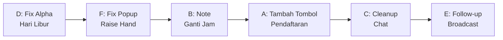

# 📋 NEW5_PLANS — Rencana Fitur Batch 5

> **Dokumen rencana implementasi fitur baru batch ke-5**
> Dibuat: 2026-10-02 | Status: Draft — Menunggu Persetujuan

---

## Daftar Fitur

| # | Fitur | Prioritas | Kompleksitas |
|---|-------|-----------|-------------|
| A | Tambah Tombol Pendaftaran Ganti Jam + Field Baru | 🔴 Tinggi | ⭐⭐ |
| B | Note Otomatis untuk Pemagang saat Ganti Jam | 🟡 Sedang | ⭐ |
| C | Auto-Cleanup Chat Ganti Jam & Bantuan (Raise Hand) | 🟡 Sedang | ⭐⭐ |
| D | Perbaikan Alpha pada Hari Libur | 🟢 Selesai | ⭐ |
| E | Follow-up Chat Personal di Scheduled Broadcast | 🟡 Sedang | ⭐⭐⭐ |
| F | Fix Popup Raise Hand Muncul Berulang / Tanpa Raise Hand | 🔴 Tinggi | ⭐⭐ |

---

## Fitur A: Tambah Tombol Pendaftaran Ganti Jam + Field Baru

### Kondisi Saat Ini

**Sistem ganti jam yang sudah berjalan TETAP seperti sekarang** — tidak diubah. Yang perlu ditambahkan hanyalah akses pendaftaran.

**Sistem pendaftaran sudah ada** di codebase:
- **Model:** `ChangeTimeRegistration` — sudah punya field `status`, `reason`, `requested_date`, `shift_id`, `office_id`, `admin_notes`, `approved_by`, `approved_at`
- **Controller:** `ChangeTimeRegistrationController` — sudah punya `store()`, `cancel()`, `adminApprove()`, `adminReject()`
- **Form Pemagang:** `resources/views/users/index.blade.php` line 1050-1113 — form hanya meminta field `reason` (textarea)
- **Chat/Diskusi:** Model `ChangeTimeNote` mendukung diskusi dua arah admin ↔ pemagang
- **Admin Panel:** `AdminChangeTimeController` — sudah punya `approve()`, `reject()`, `updateTime()`

> [!CAUTION]
> **Masalah Utama:** Tombol untuk membuka form pendaftaran ganti jam **TIDAK ADA / TERSEMBUNYI** saat pemagang belum punya pendaftaran aktif. Modal `#changeTimeModal` ada di DOM tapi tidak ada trigger button. Tombol "Diskusi / Detail" hanya muncul jika `$activeRegistration` sudah ada. Artinya pemagang **tidak bisa mendaftar sama sekali**.

### Perubahan yang Diminta

1. **Tambahkan tombol pendaftaran** — tombol yang visible di dashboard pemagang agar bisa membuka form
2. **Tambah field di form:**
   - **Hari/Tanggal rencana** — kapan pemagang berencana ganti jam
   - **Shift yang diinginkan** — shift mana yang dipilih
3. **Status approval lebih jelas** di sisi pemagang (approved / belum approved)

> [!NOTE]
> Sistem ganti jam saat ini (presensi masuk/keluar, sesi, approval session, dll) **tidak diubah**. Hanya alur pendaftaran yang diperbaiki.

### Rencana Implementasi

#### A1. Aktifkan Kembali Tombol Pendaftaran di Dashboard

**File:** `resources/views/users/index.blade.php`

Saat ini tombol hanya muncul jika `$activeRegistration` ada. Perlu tambahkan tombol / link yang visible saat pemagang belum punya pendaftaran aktif DAN memiliki hutang jam:

```blade
@if(!isset($activeRegistration) || !$activeRegistration)
    {{-- Tampilkan tombol Daftar Ganti Jam di area yang mudah terlihat --}}
    <button type="button" onclick="openPraDaftarGantiJamModal()"
        class="px-4 py-2 bg-amber-600 hover:bg-amber-700 text-white rounded-xl text-xs font-bold ...">
        <i class="fa-solid fa-calendar-plus"></i>
        Daftar Ganti Jam
    </button>
@endif
```

Lokasi kandidat: di area informasi hutang jam, atau di card khusus "Ganti Jam" pada dashboard pemagang.

#### A2. Update Form Pendaftaran Pemagang

**File:** `resources/views/users/index.blade.php` (line 1050-1113)

```
Form saat ini:
┌─────────────────────────────┐
│ Catatan / Rencana Ganti Jam │  ← textarea (sudah ada)
└─────────────────────────────┘

Form baru:
┌─────────────────────────────┐
│ Hari/Tanggal Rencana        │  ← input date (BARU)
├─────────────────────────────┤
│ Shift yang Dipilih          │  ← select dropdown (BARU)
├─────────────────────────────┤
│ Catatan / Rencana Ganti Jam │  ← textarea (sudah ada)
└─────────────────────────────┘
```

**Logika baru:**
- Field `requested_date` diisi dari input date (wajib, minimal hari ini)
- Field `shift_id` diisi dari dropdown shift (wajib, hanya shift yang diizinkan dari `ChangeTimeSetting.allowed_shift_ids`)
- Field `reason` tetap wajib (textarea catatan/rencana)

#### A3. Update Controller Store

**File:** `app/Http/Controllers/ChangeTimeRegistrationController.php` method `store()` (line 27-90)

Perubahan:
```php
// Validasi baru
$request->validate([
    'requested_date' => 'required|date|after_or_equal:today',
    'shift_id'       => 'required|exists:shifts,id',
    'reason'         => 'required|string|max:500',
]);

// Simpan dengan field baru
ChangeTimeRegistration::create([
    'intern_id'      => $intern->id,
    'requested_date' => $request->input('requested_date'),
    'shift_id'       => $request->input('shift_id'),
    'reason'         => $request->input('reason'),
    'status'         => 'pending',  // Tetap pending, harus di-approve admin
]);
```

#### A4. Alur Approval Admin

**File:** `app/Http/Controllers/AdminChangeTimeController.php`

Alur sudah ada, perlu penyesuaian:
1. Admin melihat pendaftaran baru (status: `pending`) di halaman `persetujuan-ganti-jam`
2. Admin bisa **membalas via chat note** untuk tanya atau koreksi tanggal/shift
3. Admin bisa **mengubah tanggal/shift** via `updateTime()` — method ini sudah ada
4. Admin bisa **Approve** (`approve()`) → status berubah ke `approved`
5. Admin bisa **Reject** (`reject()`) → status berubah ke `rejected`

#### A5. Penambahan Status Badge di Dashboard Pemagang

**File:** `resources/views/users/index.blade.php` (area banner pendaftaran aktif, line 258-290)

Saat pemagang melakukan ganti jam:
- **Jika `registration.status === 'pending'`**: Badge kuning "⏳ Menunggu Persetujuan Admin"
- **Jika `registration.status === 'approved'`**: Badge hijau "✅ Disetujui — Siap Dilaksanakan"
- **Jika `registration.status === 'rejected'`**: Badge merah "❌ Ditolak — Lihat Alasan"

Saat sesi ganti jam berjalan (di `ChangeTimeInfoContainer` Livewire):
- Tambahkan badge approval status: "Approved ✅" atau "Belum Approved ⏳"

#### A6. File yang Perlu Diubah

| File | Perubahan |
|------|-----------|
| `resources/views/users/index.blade.php` | Tambah field date & shift di form pendaftaran |
| `app/Http/Controllers/ChangeTimeRegistrationController.php` | Update validasi & create |
| `resources/views/users/index.blade.php` | Update badge status di banner pendaftaran |
| `app/Livewire/ChangeTimeInfoContainer.php` | Tambah badge approval status saat sesi berjalan |
| `resources/views/livewire/change-time-info-container.blade.php` | UI badge approval |
| `resources/views/admin/persetujuan-ganti-jam.blade.php` *(jika ada)* | Pastikan info tanggal & shift ditampilkan |

#### A6. Migrasi Database

**Tidak perlu migrasi baru** — field `requested_date` dan `shift_id` sudah ada di tabel `change_time_registrations` dan sudah di-declare di model `$fillable`.

---

## Fitur B: Note Otomatis untuk Pemagang saat Ganti Jam

### Kondisi Saat Ini

- Model `ChangeTimeSetting` sudah ada (`app/Models/ChangeTimeSetting.php`) dengan field: `restrict_to_holidays`, `allowed_shift_ids`, `allowed_office_ids`, `default_office_id`
- **Belum ada field** untuk teks note/pengumuman otomatis yang ditampilkan ke pemagang

### Rencana Implementasi

#### B1. Tambah Kolom di `change_time_settings`

Buat migrasi baru:
```php
Schema::table('change_time_settings', function (Blueprint $table) {
    $table->text('intern_notice_text')->nullable()
          ->comment('Teks catatan/pengumuman yang ditampilkan ke pemagang saat mendaftar atau menjalankan ganti jam');
});
```

#### B2. Halaman Admin untuk Set Teks Note

**File:** Halaman pengaturan ganti jam admin (cari di settings atau buat section baru)

Tambahkan textarea di halaman pengaturan ganti jam:
```
┌────────────────────────────────────────────┐
│ Catatan / Pengumuman untuk Pemagang        │
│ ┌────────────────────────────────────────┐ │
│ │ (textarea isi teks note)               │ │
│ │ Contoh: "Pastikan bawa laptop dan      │ │
│ │ hadir tepat waktu..."                  │ │
│ └────────────────────────────────────────┘ │
│ [Simpan]                                   │
└────────────────────────────────────────────┘
```

#### B3. Tampilkan Note di Sisi Pemagang

**Lokasi tampil:**
1. Di form pendaftaran ganti jam (info box di atas form) — `resources/views/users/index.blade.php`
2. Di banner pendaftaran aktif — `resources/views/users/index.blade.php` (line 258-290)
3. Di Livewire `ChangeTimeInfoContainer` saat sesi berjalan

```php
// Cara baca:
$notice = ChangeTimeSetting::getSettings()->intern_notice_text;
```

#### B4. File yang Perlu Diubah

| File | Perubahan |
|------|-----------|
| Migrasi baru | Tambah kolom `intern_notice_text` di `change_time_settings` |
| `app/Models/ChangeTimeSetting.php` | Tambah `intern_notice_text` ke `$fillable` |
| Halaman settings admin ganti jam | Tambah textarea input |
| `resources/views/users/index.blade.php` | Tampilkan note di form & banner |
| `app/Livewire/ChangeTimeInfoContainer.php` | Kirim `$notice` ke view |
| `resources/views/livewire/change-time-info-container.blade.php` | Tampilkan note |

---

## Fitur C: Auto-Cleanup Chat Ganti Jam & Bantuan (Raise Hand)

### Kondisi Saat Ini

**Chat Ganti Jam:**
- Model `ChangeTimeNote` (tabel `change_time_notes`) — berisi pesan diskusi antara admin ↔ pemagang per pendaftaran (`registration_id`) dan per sesi (`session_id`)
- Popup toast chat muncul di panel admin via `raise-hand-notifications.js` yang polling endpoint `/admin/persetujuan-ganti-jam/unread-chats`
- **Masalah:** Log chat menumpuk di database meskipun sesi ganti jam sudah selesai

**Bantuan (Raise Hand):**
- Model `HandRaise` (tabel `hand_raises`) + `HandRaiseMessage` (tabel `hand_raise_messages`)
- Popup toast bantuan muncul di panel admin
- **Masalah:** Data request bantuan yang sudah `status = 'done'` tetap tersimpan selamanya

### Rencana Implementasi

#### C1. Auto-Cleanup Chat Ganti Jam

**Trigger:** Saat sesi ganti jam status berubah ke `approved` atau `rejected` (selesai diproses admin), dan saat pendaftaran status berubah ke `completed` atau `cancelled`.

**Logika:**
```php
// Di AdminChangeTimeController atau observer model
// Setelah approve/reject/complete session:

// Hapus semua notes terkait sesi ini
ChangeTimeNote::where('session_id', $session->id)->delete();

// Hapus juga notes terkait registrasi jika sudah selesai
if ($registration->status === 'completed' || $registration->status === 'cancelled') {
    ChangeTimeNote::where('registration_id', $registration->id)->delete();
}
```

**Alternatif (lebih aman):** Gunakan soft-delete atau archiving — pindahkan ke tabel `change_time_notes_archive` sebelum hapus.

#### C2. Auto-Cleanup Bantuan (Raise Hand)

**Trigger:** Saat status HandRaise berubah ke `done`.

**Logika:**
```php
// Di HandRaiseController saat status -> done:

// Hapus semua pesan terkait request ini
HandRaiseMessage::where('hand_raise_id', $handRaise->id)->delete();

// Hapus request itu sendiri (atau soft-delete)
$handRaise->delete();
```

> [!WARNING]
> **Pertimbangan:** Pastikan admin tidak perlu melihat history chat bantuan lagi setelah selesai. Jika perlu history, gunakan soft-delete (`SoftDeletes` trait) dan tambahkan halaman log/arsip.

#### C3. Scheduled Cleanup (Cron) — Opsional

Sebagai jaring pengaman, tambahkan Artisan command untuk membersihkan data lama:

```php
// app/Console/Commands/CleanupCompletedChats.php
// Hapus notes/messages dari sesi/bantuan yang sudah selesai > 7 hari

$cutoff = Carbon::now()->subDays(7);

// Cleanup ganti jam notes
ChangeTimeNote::whereHas('session', fn($q) => $q->whereIn('status', ['approved', 'rejected'])->where('updated_at', '<', $cutoff))
    ->delete();

// Cleanup raise hand messages & records
$doneRaises = HandRaise::where('status', 'done')->where('updated_at', '<', $cutoff)->get();
foreach ($doneRaises as $raise) {
    $raise->messages()->delete();
    $raise->delete();
}
```

Registrasi di `app/Console/Kernel.php`:
```php
$schedule->command('cleanup:completed-chats')->dailyAt('02:00');
```

#### C4. File yang Perlu Diubah

| File | Perubahan |
|------|-----------|
| `app/Http/Controllers/AdminChangeTimeController.php` | Hapus notes setelah approve/reject session |
| `app/Http/Controllers/HandRaiseController.php` | Hapus messages + record setelah status done |
| Buat `app/Console/Commands/CleanupCompletedChats.php` | Scheduled cleanup command |
| `app/Console/Kernel.php` | Register scheduled command |

---

## Fitur D: Perbaikan Alpha pada Hari Libur (✅ SELESAI)

### Kondisi Sebelumnya — Bug

**Method:** `AttendanceService::markMissedSchedulesAsAlpha()` (line 2360-2415)

Method sebelumnya **tidak mengecek apakah tanggal jadwal adalah hari libur (`Holiday`) atau hari Minggu** sebelum menandai alpha. Akibatnya jadwal pemagang di hari libur otomatis ditandai `attd_status_id = 5` (Alpha) dan membebankan hutang jam penuh.

### Perbaikan yang Telah Dilakukan

1. **`app/Services/AttendanceService.php` (`markMissedSchedulesAsAlpha`)**:
   - Menambahkan query tanggal libur dari tabel `holidays`.
   - Menambahkan skip jika `$isSunday` atau `$isHoliday` sehingga jadwal pada hari libur / Minggu tidak akan diubah ke Alpha.
2. **`app/Services/DebtCalculationService.php` (`calculateScheduleBaseDebt`)**:
   - Menambahkan pengecekan hari libur dan Minggu. Jika hari libur / Minggu dan tidak ada presensi masuk, maka beban hutang jam dasar adalah 0 (bukan hutang 1 shift).
3. **`app/Http/Controllers/UserController.php` (`calculateInternScheduleDeficits`)**:
   - Menambahkan pre-fetch daftar libur nasional dan melewati jadwal hari libur / Minggu yang tidak memiliki presensi masuk.
4. **Pembersihan Data Alpha Lama**:
   - 6 record `DetailSchedule` pada tanggal libur yang sempat salah ditandai Alpha (status 5) telah di-reset kembali ke status 1 (Dijadwalkan).

**File:** `app/Services/AttendanceService.php` (line 2360-2415)

```php
public function markMissedSchedulesAsAlpha(): void
{
    try {
        $today = Carbon::today()->toDateString();
        $now = Carbon::now();

        // BARU: Ambil semua tanggal libur yang relevan
        $holidayDates = Holiday::whereDate('date', '<=', $today)
            ->pluck('date')
            ->map(fn($d) => Carbon::parse($d)->toDateString())
            ->toArray();

        $missedSchedules = DetailSchedule::whereDate('date', '<=', $today)
            ->where('attd_status_id', 1)
            ->where(function ($query) { /* ... sama ... */ })
            ->with('shift')
            ->get();

        $alphaIds = [];
        foreach ($missedSchedules as $schedule) {
            $scheduleDate = Carbon::parse($schedule->date)->toDateString();

            // BARU: Skip jika hari libur atau Minggu
            $isSunday = Carbon::parse($scheduleDate)->isSunday();
            $isHoliday = in_array($scheduleDate, $holidayDates);
            if ($isSunday || $isHoliday) {
                continue; // Jangan tandai alpha pada hari libur
            }

            if ($scheduleDate < $today) {
                $alphaIds[] = $schedule->id;
                continue;
            }

            if ($scheduleDate === $today && $schedule->shift && $schedule->shift->end_time) {
                $shiftEndTime = Carbon::parse($schedule->shift->end_time);
                if ($now->greaterThan($shiftEndTime)) {
                    $alphaIds[] = $schedule->id;
                }
            }
        }

        if (!empty($alphaIds)) {
            DetailSchedule::whereIn('id', $alphaIds)
                ->update(['attd_status_id' => 5]);
        }
    } catch (\Exception $e) {
        Log::error('markMissedSchedulesAsAlpha error: ' . $e->getMessage());
    }
}
```

#### D2. Opsi Tambahan — Cleanup Alpha yang Sudah Salah Ditandai

Jika sudah ada data alpha pada hari libur yang harus dibersihkan:

```php
// One-time fix: Reset alpha pada hari libur kembali ke "Dijadwalkan"
$holidayDates = Holiday::pluck('date')->map(fn($d) => Carbon::parse($d)->toDateString());
$sundayDates = /* collect all Sundays in range */;

DetailSchedule::where('attd_status_id', 5)
    ->where(function ($q) use ($holidayDates, $sundayDates) {
        $q->whereIn(DB::raw('DATE(date)'), $holidayDates)
          ->orWhereIn(DB::raw('DATE(date)'), $sundayDates);
    })
    ->update(['attd_status_id' => 1]); // Reset ke Dijadwalkan
```

#### D3. File yang Perlu Diubah

| File | Perubahan |
|------|-----------|
| `app/Services/AttendanceService.php` line 2360-2415 | Tambah cek Holiday & Sunday sebelum mark alpha |
| Opsional: Artisan command satu kali | Fix data alpha pada hari libur yang sudah salah |

---

## Fitur E: Follow-up Chat Personal di Scheduled Broadcast

### Kondisi Saat Ini

**Scheduled Broadcast:**
- Model `Broadcast` — field: `category`, `title`, `message`, `requires_report`, `report_question`, `scheduled_at`
- Model `BroadcastReport` — field: `broadcast_id`, `user_id`, `report` (jawaban pemagang)
- Admin bisa membuat broadcast terjadwal yang meminta laporan/jawaban dari pemagang
- Admin bisa melihat siapa yang sudah menjawab via `showReports()` method
- **Tidak ada** fitur untuk admin membalas/follow-up jawaban pemagang secara personal

**Yang diminta:** Admin ingin bisa mengirim chat personal ke pemagang yang sudah menjawab broadcast, untuk menanyakan lebih lanjut.

### Rencana Implementasi

#### E1. Buat Tabel Baru `broadcast_report_chats`

```php
Schema::create('broadcast_report_chats', function (Blueprint $table) {
    $table->id();
    $table->foreignId('broadcast_report_id')->constrained('broadcast_reports')->cascadeOnDelete();
    $table->foreignId('user_id')->constrained('users');  // pengirim (admin atau pemagang)
    $table->text('message');
    $table->boolean('is_from_admin')->default(false);
    $table->boolean('is_read')->default(false);
    $table->timestamps();
});
```

#### E2. Buat Model `BroadcastReportChat`

```php
class BroadcastReportChat extends Model
{
    protected $fillable = [
        'broadcast_report_id', 'user_id', 'message',
        'is_from_admin', 'is_read',
    ];

    public function report(): BelongsTo { ... }
    public function user(): BelongsTo { ... }
}
```

#### E3. Update `BroadcastReport` Model

Tambah relasi:
```php
public function chats(): HasMany
{
    return $this->hasMany(BroadcastReportChat::class)->orderBy('created_at', 'asc');
}

public function hasUnreadChats(bool $fromAdmin = false): bool
{
    return $this->chats()
        ->where('is_from_admin', $fromAdmin)
        ->where('is_read', false)
        ->exists();
}
```

#### E4. Controller Methods

**File:** `app/Http/Controllers/ScheduledBroadcastController.php`

Tambah methods:
```php
// Admin mengirim pesan follow-up ke pemagang
public function sendFollowUp(Request $request, BroadcastReport $report)
{
    $request->validate(['message' => 'required|string|max:1000']);

    BroadcastReportChat::create([
        'broadcast_report_id' => $report->id,
        'user_id'             => auth()->id(),
        'message'             => $request->message,
        'is_from_admin'       => true,
    ]);

    return back()->with('success', 'Pesan follow-up berhasil dikirim.');
}

// Pemagang membalas follow-up admin
public function replyFollowUp(Request $request, BroadcastReport $report)
{
    // ... validasi & create chat dengan is_from_admin = false
}
```

#### E5. UI Admin — Modal Detail Jawaban + Chat

Di halaman scheduled broadcast, pada modal `showReports()`:
```
┌──────────────────────────────────────┐
│ Jawaban: Ahmad Fauzi                 │
│ "Sudah selesai mengerjakan bab 3..." │
│                                      │
│ 💬 Chat Follow-up:                   │
│ ┌──────────────────────────────────┐ │
│ │ Admin: Bab 3 bagian mana saja?  │ │
│ │ Ahmad: Bagian A dan B           │ │
│ │ Admin: Oke, lanjutkan bab 4     │ │
│ └──────────────────────────────────┘ │
│ ┌──────────────────────┐ [Kirim]    │
│ │ Tulis pesan...       │            │
│ └──────────────────────┘            │
└──────────────────────────────────────┘
```

#### E6. UI Pemagang — Popup Follow-up dari Admin

Tambahkan pengecekan di Livewire `BroadcastPopup`:
- Cek jika ada `BroadcastReportChat` yang `is_from_admin = true && is_read = false`
- Tampilkan popup/notifikasi bahwa admin mengirim pesan tindak lanjut tentang jawaban broadcast
- Pemagang bisa membuka dan membalas

#### E7. File yang Perlu Diubah/Dibuat

| File | Perubahan |
|------|-----------|
| Migrasi baru | Buat tabel `broadcast_report_chats` |
| Buat `app/Models/BroadcastReportChat.php` | Model baru |
| `app/Models/BroadcastReport.php` | Tambah relasi `chats()` + helper |
| `app/Http/Controllers/ScheduledBroadcastController.php` | Tambah `sendFollowUp()`, `replyFollowUp()` |
| `routes/web.php` | Tambah route POST follow-up |
| `resources/views/admin/scheduled-broadcast.blade.php` | Update modal detail jawaban + chat UI |
| `app/Livewire/BroadcastPopup.php` | Cek unread follow-up dari admin |
| `resources/views/livewire/broadcast-popup.blade.php` | UI popup notifikasi follow-up |

---

## Fitur F: Fix Popup Raise Hand Muncul Berulang / Tanpa Raise Hand

### Gejala

Popup "Tanggapan dari Admin" / "Selesai Dievaluasi" / "Permintaan Tugas Baru" **muncul berulang kali** walaupun pemagang sudah menekan "Mengerti". Bahkan muncul untuk raise hand yang sudah sangat lama selesai, atau muncul tanpa ada raise hand aktif.

### Kondisi Saat Ini

**Lokasi:** `AttdStatusButton::checkRealtimeNotifications()` — file `app/Livewire/AttdStatusButton.php` (line 751-892)

**Mekanisme "seen" saat ini:**
```
Session key:  seen_raise_response_{id}_{timestamp}
Cache key:    user_seen_raise_response_{userId}_{id}_{timestamp}
```

Popup hanya di-skip jika **DUA syarat terpenuhi:**
1. Session punya key tersebut (`session()->has($seenKey)`)
2. ATAU cache punya key tersebut (`Cache::has($cacheKey)`)
3. DAN notifikasi tidak lebih dari 24 jam (`$isOldNotification`)

### Akar Masalah (3 Bug)

#### Bug 1: Session Hilang pada Livewire Re-render

```php
$seenKey = 'seen_raise_response_' . $latestResponse->id . '_' . $responseTimestamp;
// ↑ Key mengandung timestamp dari updated_at
```

**Masalah:** Jika ada proses lain yang meng-`touch()` record `HandRaise` (misal: admin mengedit field lain, atau scheduled job memperbarui record), maka `updated_at` berubah → timestamp berubah → **key berubah** → popup muncul lagi karena key baru belum pernah di-mark seen.

#### Bug 2: Query Terlalu Luas — Menangkap Record Lama

```php
$latestResponse = HandRaise::with(['resolver.profile'])
    ->where('user_id', $userId)
    ->where(function ($q) use ($userId) {
        $q->where(function ($sq) use ($userId) {
            $sq->whereIn('status', ['accepted', 'rescheduled', 'rejected', 
                                     'responded', 'in_progress', 'ready', 'needs_revision'])
                ->where(function ($ssq) use ($userId) {
                    $ssq->whereNull('resolved_by')
                        ->orWhere('resolved_by', '!=', $userId);
                });
        })
        ->orWhere(function ($sq) use ($userId) {
            $sq->where('status', 'done')        // ← Menangkap SEMUA yang done!
                ->whereNotNull('resolved_by')
                ->where('resolved_by', '!=', $userId);
        })
        // ...
    })
    ->latest('updated_at')
    ->first();
```

**Masalah:** Query ini menangkap **semua** HandRaise yang pernah di-resolve admin — termasuk yang sudah selesai berminggu-minggu lalu. Filter `$isOldNotification` (24 jam) seharusnya mencegah ini, tapi:

#### Bug 3: Filter 24 Jam Tidak Konsisten

```php
$isOldNotification = $latestResponse->updated_at 
    && $latestResponse->updated_at->lt(now()->subHours(24));

if (!session()->has($seenKey) && !Cache::has($cacheKey) && !$isOldNotification) {
```

**Masalah:**
- Cache `file` driver bisa kehilangan data saat cache:clear atau restart server → `Cache::has($cacheKey)` return false → popup muncul lagi
- Session hilang saat browser ditutup → popup muncul lagi pada login berikutnya
- Jika `updated_at` dalam 24 jam terakhir (misal admin baru update sesuatu kecil), popup muncul lagi walaupun pemagang sudah pernah lihat

### Rencana Perbaikan

#### F1. Tambah Kolom `notification_seen_at` di Tabel `hand_raises`

Ganti mekanisme session/cache yang fragile dengan **kolom database yang persisten**:

```php
// Migrasi baru
Schema::table('hand_raises', function (Blueprint $table) {
    $table->timestamp('notification_seen_at')->nullable()
          ->after('resolved_at')
          ->comment('Kapan pemagang terakhir melihat popup notifikasi untuk raise hand ini');
});
```

#### F2. Simplifikasi Logic `checkRealtimeNotifications()`

**File:** `app/Livewire/AttdStatusButton.php` (line 789-892)

```php
// LOGIKA BARU (menggantikan session+cache):
$latestResponse = HandRaise::with(['resolver.profile'])
    ->where('user_id', $userId)
    ->whereIn('status', ['accepted', 'rescheduled', 'rejected', 'responded', 
                          'in_progress', 'ready', 'needs_revision', 'done'])
    ->where(function ($q) use ($userId) {
        $q->whereNull('resolved_by')
          ->orWhere('resolved_by', '!=', $userId);
    })
    // BARU: Hanya ambil yang belum pernah dilihat ATAU updated setelah terakhir dilihat
    ->where(function ($q) {
        $q->whereNull('notification_seen_at')
          ->orWhereColumn('updated_at', '>', 'notification_seen_at');
    })
    // BARU: Batasi hanya 7 hari terakhir (bukan 24 jam)
    ->where('updated_at', '>=', now()->subDays(7))
    ->latest('updated_at')
    ->first();

if ($latestResponse) {
    // Tampilkan popup...
}
```

#### F3. Update `dismissAdminResponseModal()` — Tulis ke Database

```php
public function dismissAdminResponseModal(int $id, int $timestamp): void
{
    // BARU: Tandai di database (persisten, tidak hilang)
    HandRaise::where('id', $id)->update([
        'notification_seen_at' => now(),
    ]);

    $this->showAdminResponseModal = false;
    $this->adminResponseData = null;
}
```

#### F4. Update Semua `markRaiseHandSeen()` yang Tersebar

Ganti semua panggilan `markRaiseHandSeen()` (ada di line 1164, 1205, 1257, 1354, 1405, 1458) agar juga menulis ke `notification_seen_at`:

```php
private function markRaiseHandSeen(?int $id): void
{
    if (!$id) return;
    HandRaise::where('id', $id)->update([
        'notification_seen_at' => now(),
    ]);
}
```

#### F5. File yang Perlu Diubah

| File | Perubahan |
|------|-----------|
| Migrasi baru | Tambah kolom `notification_seen_at` di `hand_raises` |
| `app/Models/HandRaise.php` | Tambah `notification_seen_at` ke `$fillable` dan `$casts` |
| `app/Livewire/AttdStatusButton.php` | Simplifikasi `checkRealtimeNotifications()`, update `markRaiseHandSeen()`, update `dismissAdminResponseModal()` |

> [!TIP]
> **Keuntungan pendekatan database:**
> - Tidak terpengaruh oleh cache:clear, server restart, atau session expired
> - Tidak ada duplikasi karena `notification_seen_at` per record, bukan per timestamp
> - Satu sumber kebenaran — tidak perlu sinkronisasi antara session + cache + 24h filter
> - Popup dijamin hanya muncul **1x per perubahan status** pada raise hand tersebut

---

## Urutan Implementasi yang Disarankan



| Urutan | Fitur | Alasan |
|--------|-------|--------|
| 1️⃣ | **D: Fix Alpha Hari Libur** | Paling kritis — bug aktif yang menyebabkan data salah. Paling sederhana (1 file). |
| 2️⃣ | **F: Fix Popup Raise Hand** | Bug aktif yang mengganggu UX pemagang. Perlu 1 migrasi kecil + refactor 1 file. |
| 3️⃣ | **B: Note Ganti Jam** | Sederhana (1 migrasi + beberapa view). Fondasi untuk Fitur A. |
| 4️⃣ | **A: Tambah Tombol Pendaftaran** | Fitur utama. Tidak butuh migrasi baru (field sudah ada). |
| 5️⃣ | **C: Cleanup Chat** | Setelah alur ganti jam stabil, baru tambahkan auto-cleanup. |
| 6️⃣ | **E: Follow-up Broadcast** | Fitur independen, bisa dikerjakan terakhir. Butuh tabel baru + UI baru. |

---

## Ringkasan Migrasi Database

| Migrasi | Tabel | Perubahan |
|---------|-------|-----------|
| `add_intern_notice_to_change_time_settings` | `change_time_settings` | Tambah kolom `intern_notice_text` (text, nullable) |
| `add_notification_seen_at_to_hand_raises` | `hand_raises` | Tambah kolom `notification_seen_at` (timestamp, nullable) |
| `create_broadcast_report_chats_table` | `broadcast_report_chats` | Tabel baru untuk follow-up chat broadcast |

> [!NOTE]
> Fitur A **tidak memerlukan migrasi** karena kolom `requested_date` dan `shift_id` sudah ada di tabel `change_time_registrations`.

---

## Ringkasan Model yang Terpengaruh

| Model | Perubahan |
|-------|-----------|
| `ChangeTimeRegistration` | Tidak ada perubahan model (field sudah ada) |
| `ChangeTimeSetting` | Tambah `intern_notice_text` ke `$fillable` |
| `ChangeTimeNote` | Tidak ada perubahan (hanya dihapus saat cleanup) |
| `HandRaise` | Tambah `notification_seen_at` ke `$fillable` dan `$casts` |
| `HandRaiseMessage` | Tidak ada perubahan (hanya dihapus saat cleanup) |
| `Broadcast` | Tidak ada perubahan |
| `BroadcastReport` | Tambah relasi `chats()` |
| `BroadcastReportChat` | **Model baru** |
